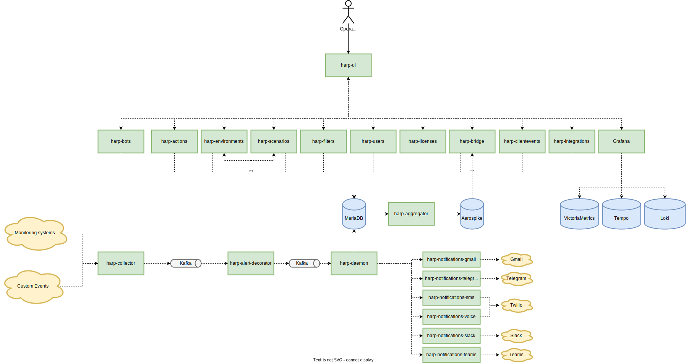

We are excited to announce that our incident management system is now open source! 

Our incident management system is designed to help teams quickly and effectively respond to and resolve any incidents that may occur, specifically in the tech industry.

### Features
It includes features such as incident categorization, incident escalation, and real-time communication tools.

### Open Sourcing
By open sourcing the system, we hope to make it more widely accessible to tech companies and organizations, and to encourage collaboration and contributions from the wider community. 

We believe that by working together, we can improve the system and make it even more powerful and effective in addressing tech-related incidents.

### Getting Started
To help you get started, we have also provided links to our [documentation](https://docs.harpia.io/docs/intro), [Linkedin](https://www.linkedin.com/in/the-harpia-io),  [official website](https://harpia.io), and a [live demo](https://playground.harpia.io/#/login-?demo=true) of the system on our website.

We also have a signup form where you can [create a new account](https://registration.harpia.io/) for free to work with system.

Also, you can install platform on your [own server](docs/platform-installation#on-your-server) or [inside Kubernetes](docs/platform-installation#in-kubernetes)

### Contribution
If you are interested in contributing to the project, please visit our [GitHub repository](https://github.com/harpia-io/harpia) to learn more and to access the code. 

Our team is also available for any questions or collaborations at nikolay.k@harpia.io or [GitHub Issues](https://github.com/harpia-io/harpia/issues).

### Subscription-based Support
In addition, we also provide a subscription-based support service for our incident management system. 

This includes access to priority support, regular updates, and additional features. 

If you are interested in this service, please contact us at nikolay.k@harpia.io for more information and pricing.

### Technologies used
We use a combination of technologies such as Vue.js, Python, Aerospike, Kafka, VitoriaMetrics and MariaDB to build the system.

### Architecture Overview
Our incident management system is built on a microservices architecture, utilizing a combination of APIs and event-driven communication. 

The system is composed of several services that work together to provide the functionality of incident categorization, escalation, and real-time communication. 

Each service is designed to be independent and can be deployed independently, allowing for flexibility and scalability.

**1.  Technical flow to process alerts:**
- [harp-collectors](https://github.com/harpia-io/harp-collectors): receive alerts from monitoring system, unify the structure and push them to Kafka topic
- [harp-alert-decorator](https://github.com/harpia-io/harp-alert-decorator): read alert from Kafka topic (produced by harp-collectors) and add additional info about environments and scenarios that should be applied to the alert
- [harp-daemon](https://github.com/the-harpia-io/harp-daemon): read alert from Kafka topic (produced by harp-alert-decorator), describe the logic and state of the alert and write result to MariaDB
- [harp-aggregator](https://github.com/harpia-io/harp-aggregator): read alerts from MariaDB, aggregate it and send to Aerospike
- [harp-bridge](https://github.com/harpia-io/harp-bridge): read alerts from Aerospike and send to UI via websockets
- [harp-ui](https://github.com/harpia-io/harp-ui): the main user interface of the platform

**2. Additional Services:**
- [harp-filters](https://github.com/harpia-io/harp-filters): create and manage the user specific filters in UI
- [harp-actions](https://github.com/harpia-io/harp-actions): manage alerts - handle, snooze, acknowledge
- [harp-environments](https://github.com/harpia-io/harp-environments): create and manage environments
- [harp-bots](https://github.com/harpia-io/harp-bots): configure your own bots to send auto notifications to different channels - Email, SMS, Slack etc..
- [harp-integrations](https://github.com/harpia-io/harp-integrations): create and manage the integrations with your monitoring systems
- [harp-licenses](https://github.com/harpia-io/harp-licenses): monitor the usage of the alerts and notification channels
- [harp-scenarios](https://github.com/harpia-io/harp-scenarios): create and manage scenarios for alerts
- [harp-users](https://github.com/harpia-io/harp-users): create and manage users inside platform including authentication and authorization
- [harp-notifications-gmail](https://github.com/harpia-io/harp-notifications-gmail): responsible to send auto email notifications
- [harp-notifications-msteams](https://github.com/harpia-io/harp-notifications-msteams): responsible to send auto notifications to Microsoft Teams
- [harp-notifications-slack](https://github.com/harpia-io/harp-notifications-slack): responsible to send auto notifications to Slack channel
- [harp-notifications-sms](https://github.com/harpia-io/harp-notifications-sms): responsible for creating auto SMS notifications via Twilio integration
- [harp-notifications-telegram](https://github.com/harpia-io/harp-notifications-telegram): responsible to send auto notifications to Telegram channels
- [harp-notifications-voice](https://github.com/harpia-io/harp-notifications-voice): responsible for creating auto Phone Calls via Twilio integration
- [harp-clientevents](https://github.com/harpia-io/harp-clientevents): receive and analyze metrics from the frontend

**3. Platform Monitoring**:
- Prometheus metrics in VictoriaMetrics
- Traces in Grafana Tempo
- Logs in Grafana Loki
- Dashboards and Alerts in Grafana

### Conclusion
We look forward to working with you to make our incident management system the best it can be for the water industry!
