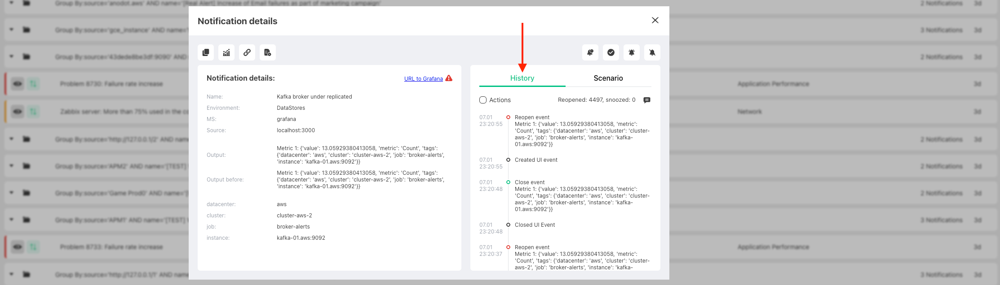

# Work with Alerts

On this article we will describe how you can manage your alert

Once you click on the alert - you can discover more details about it and perform the different actions

## Main info
On this section you can see the alert details from original monitoring system and direct URL to the system

## History

### Alert activities

You can discover the next alert activities:
- when it was created, closed, updated
- when notifications was sent and to which channel (according to the [Scenario](scenarios-overview))
- when and who snoozed, resolved, acknowledge and handle alert

### Actions by users

Hide system actions (close/open alert) and show only actions that were done by users (handle, snooze etc..)

### Add comment

You can add comment without performing any actions. It will be visible in alert history for other users

### Quick statistics

How much time alert was reopened and snoozed for the whole period of time

## Main actions with alert

Different actions will allow you to better manage the alerts

### Handle alert

Alert will be assigned to you, and it indicates that you started working with this alert.

You can specify:
- how long you are going to work with it. Other users won`t see this alert during that period of time
- to which person this alert should be assigned. By default, it will be assigned to the user who performs this action

Once alert will be handled - it will disappear from `Active tab` and appear in `Handled tab`

### Resolve alert

If for some reason, monitoring system didn`t send the resolve state to Harp, you can resolve it manually

You can add:
- comment that will be visiable in the alert history

Once alert will be resolved - it will disappear from `Active tab`

### Snooze alert

Snooze alert for specific period of time and don\`t show it in `Active tab` for other users

You can specify:
- `duration`: for how long alert should be snoozed
- `comment`: that will be visible in alert history
- `sticky severity`: if not selected - snooze will be canceled if alert severity was changed
- `sticky output`: if not selected - snooze will be canceled if alert output was changed

### Acknowledge alert

Remove alert from `active` tab and show it again once alert disappear and appear again

You should specify:
- `comment`: that will be visible in alert history

## Additional actions

### Assign alert

If you don`t want to show the alert in UI for your team who is handling them 24/7 - you can assign email address of the responsible person and he/she will receive it during specific period of time.

You can specify:
- `duration`: for how long alert should be assigned
- `sticky severity`: if not selected - assign will be canceled if alert severity was changed
- `sticky output`: if not selected - assign will be canceled if alert output was changed

### Copy direct link to the alert

You can share the direct link to the alert with your colleagues

### Copy main alert info

You can perform a quick copy of main alert info to your buffer

### Show alert statistics

You can discover all the actions that was done with the alert over the specific period of time

## Alert scenario

Display quick info about scenario to which alert is attached with possibility to modify it

