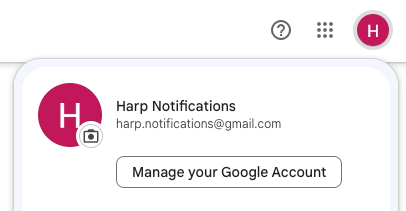
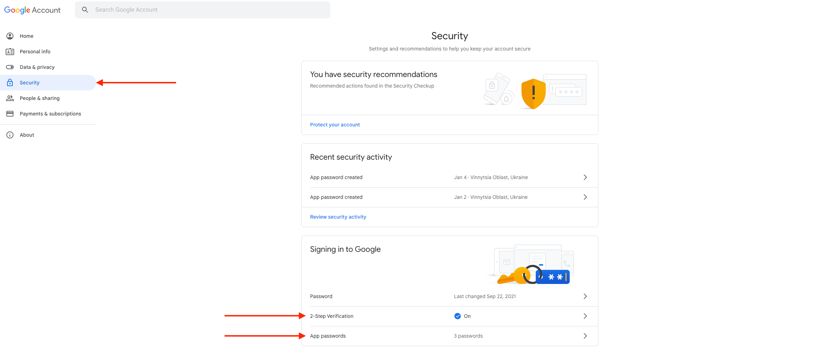
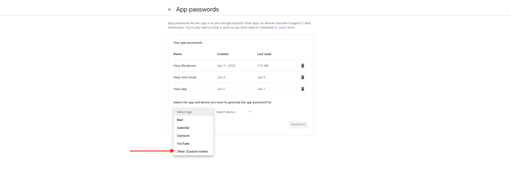
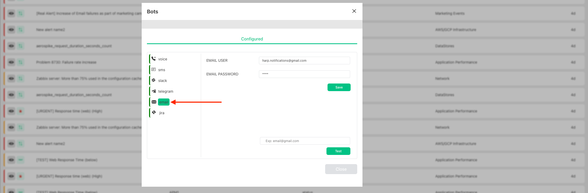
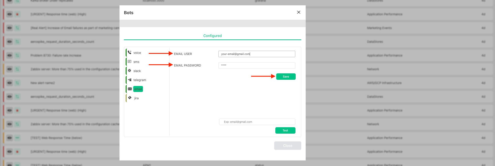
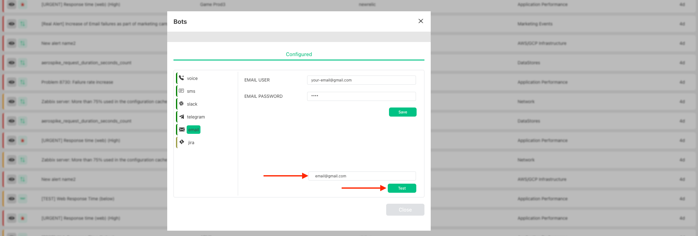
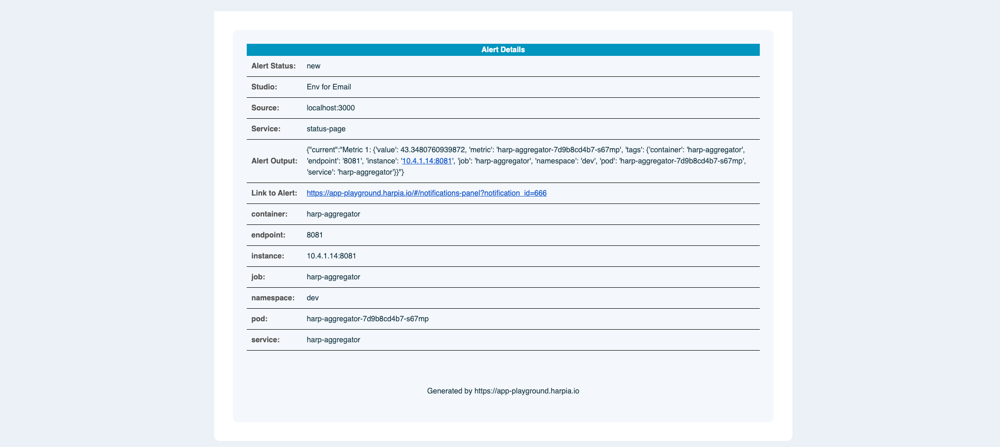

# Email Bot

You need to [register the new email](#configure-gmail-account) account (for example gmail) or use the existing.

Bot configuration requires `EMAIL USER` and `EMAIL PASSWORD`

After that you can use Email bot in [Harp Scenarios](../scenarios-overview/email.md) to describe when to send auto notification and who should receive it.

### Configure GMAIL account

Follow these steps:
1. Go to `Manage your Google Account`

2. Choose `Security tab`, activate `2-Step Verificaion` and go to `App passwords`

3. Select app - `Other`, specify the custom name and click `Generate`

4. You will see app password that you can use inside Email Harp Bot

### Configure Email Bot
1. Go to `Menu` and choose `Bots`

2. You will see the full list of available Bots

There are two different statuses:
- Yellow: Bot is not configured, and you cannot use it in [Scenarios](../scenarios-overview/scenarios-overview.md)
- Green: Bot is configured

3. Choose Email Bot

3. Specify `EMAIL USER` and `EMAIL PASSWORD` from the [previous section](#configure-gmail-account) and press `Save`

5. Go to the [Harp Scenarios settings](../scenarios-overview/email.md), and you can add Email action to your scenario

### Test Email Bot

In Bot settings you can specify the email that should receive notification and press the button `Test`

### Example of the email

Below you can see the example of the email that you will receive once the alert will be triggered

Information inside email depends on the alert configuration and the monitoring system that trigger the alert

