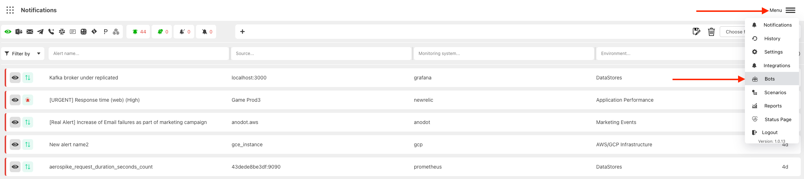
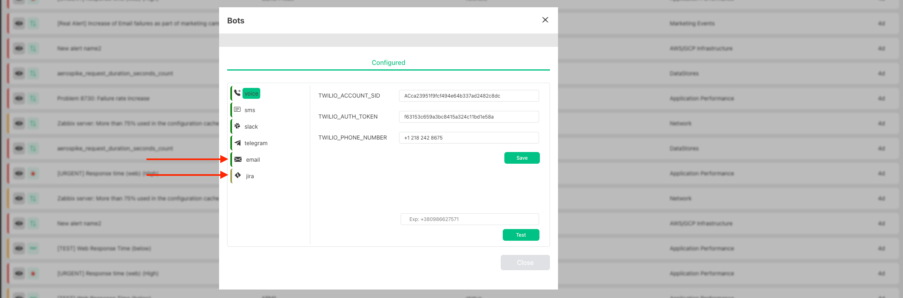

# Getting Started
:::info

By default, email Bot will be already configured, and you will receive email notifications from harp.notifications@gmail.com. You can change it to your sender at any time

:::

Harp Bot is a bot that will send auto notifications to different channels:
- [Email](email.md)
- [Slack](slack.md)
- [Telegram](telegram.md)
- [SMS](sms.md)
- [Phone call](phone-call.md)
- [JIRA](jira.md)

There are other bots that don`t require additional configuration, and you can directly use them in [Scenarios](../scenarios-overview/scenarios-overview.md):
- [PagerDuty](../scenarios-overview/pagerduty.md)
- [Signl4](../scenarios-overview/signl4.md)
- [Webhook](../scenarios-overview/webhook.md)
- [Microsoft Teams](../scenarios-overview/microsoft-teams.md)

### How to find

You can go to `Menu` -> `Bots` and check the available bots and current status

Statuses:
- Yellow: Bot is not configured, and you cannot use it in [Scenarios](../scenarios-overview/scenarios-overview.md)
- Green: Bot is configured

