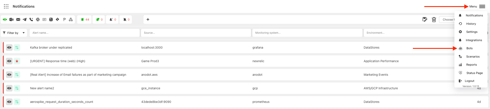

# Jira Bot

:::caution Prerequisite

JIRA Server should be accessible from the internet to provide the ability to automatically create JIRA ticket based on the alert

JIRA User should have the permissions to create the tickets in the specified project

:::

Integration with JIRA requires `JIRA Server`, `JIRA User` and `JIRA Password`

After that you can use [JIRA bot in Harp Scenarios](../scenarios-overview/jira.md) to describe when to create new JIRA ticket and in which project

### How to create new JIRA Bot

1. Go to `Menu` and choose `Bots`

2. You will see the full list of available Bots

There are two different statuses:
- Yellow: Bot is not configured, and you cannot use it in [Scenarios](../scenarios-overview/scenarios-overview.md)
- Green: Bot is configured

3. Choose JIRA Bot

3. Specify your `JIRA Server`, `JIRA User` and `JIRA Password` and press `Save`

4. Go to the [Harp Scenarios settings](../scenarios-overview/jira.md), and you can add Jira action to your scenario
