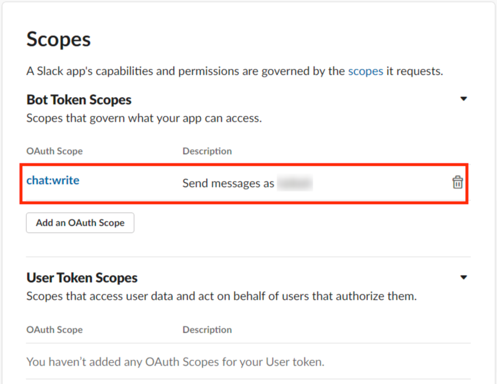
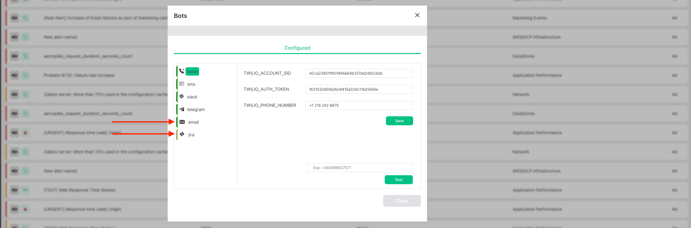

# Slack Bot

Slack Bot will send auto notification to the channel once the alert will be triggered

### 1. Create Slack Bot

1. Open slack API console. (https://api.slack.com/)
2. Click on “Your apps”

3. Click on “Create New App”

4. Click on “From scratch”

5. Now give your app name and select workspace then click on the “Create App” button.

6. Click on the “App Home” button and click on “Review Scopes to Add”.

7. After clicking on the “Review Scope to Add” button, scroll down and find the Scope section. Then click on the “Add an OAuth Scopes” Button and add “chat: write” as shown in the below image.

8. Now click on “Install to Workspace” and press on “Allow” to generate an OAuth token. You need this token to configure Slack Harp Bot

9. Now we create the channel in slack and add our app to it. To open your Slack account go to the channel bar and click on the “+” sign. Then click on “Create a new channel”.

10. Now type your channel name and click on the “Create” Button.

11. Now Add your app to the channel by just typing “/invite @Your_App_Name” (use the app name that you want to connect with the channel) in channel chat.

12. Copy Token from step #8 and go to the Harp Platform to configure Slack Bot

### 2. Configure Harp Slack Bot

1. Go to `Menu` and choose `Bots`

2. You will see the full list of available Bots

There are two different statuses:
- Yellow: Bot is not configured, and you cannot use it in [Scenarios](../scenarios-overview/scenarios-overview.md)
- Green: Bot is configured

3. Choose Slack Bot

4. Specify `Slack Bot Token` that was created in the previous section and press `Save`

5. Now you can go to the [Harp Scenarios settings](../scenarios-overview/slack.md), and you can add Slack action to your scenario

### Test Slack Bot

In Bot settings you can specify the name of the Slack Channel (should be started with #) that should receive test notification and press the button `Test`

