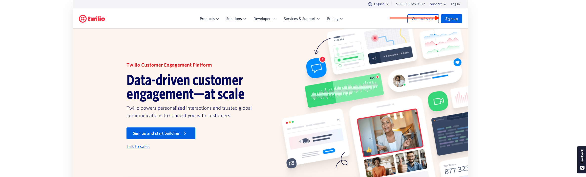
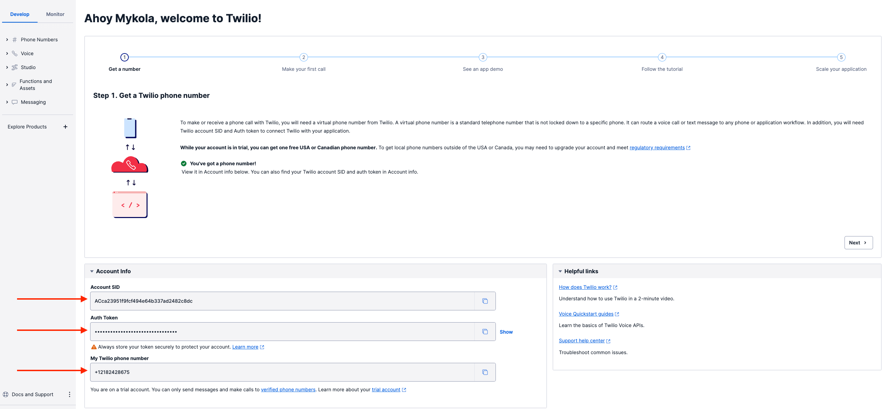
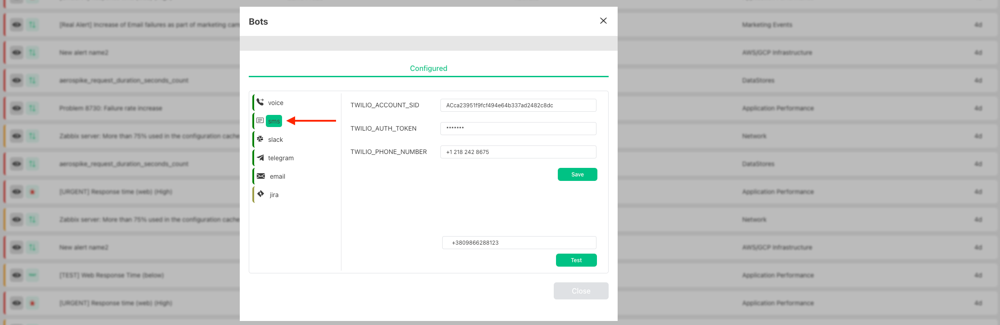
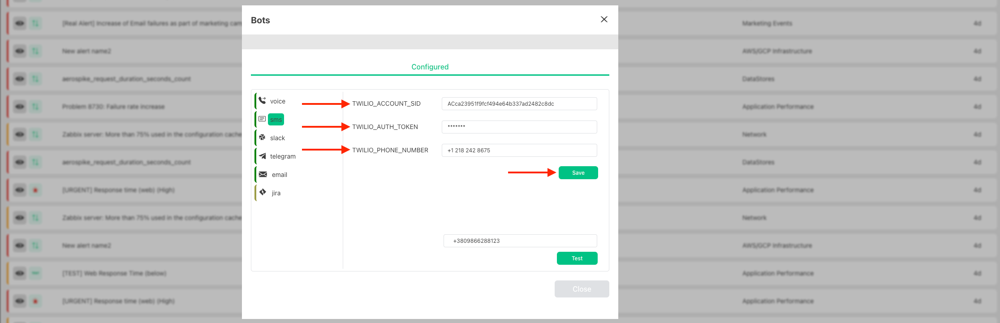
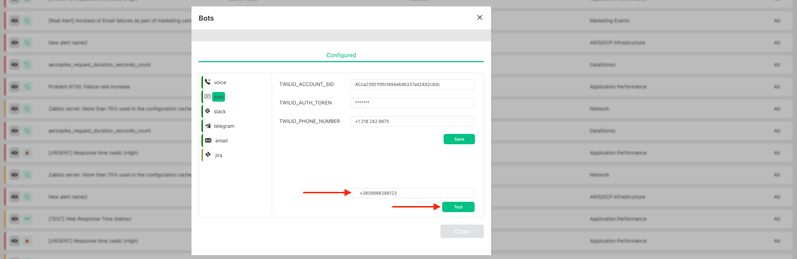

# SMS Bot

:::caution Attention

This integration is based on Twilio, and it will charge you according to their pricing model - https://www.twilio.com/sms/pricing

For new Twilio account you will receive 10$ to test how it works

:::

To receive SMS when alert was triggered you should create Twilio account and connect it to Harp

### Create Twilio account and Configure Harp SMS Bot

1. Go to the [official Twilio website](https://www.twilio.com/), `Sign Up` and follow the steps to register new account

2. From `Account info` section you need to copy: `Account SID`, `Auth Token`, `My Twilio phone number` and it will be used in the next steps

3. Go to `Menu` and choose `Bots`

4. You will see the full list of available Bots

There are two different statuses:
- Yellow: Bot is not configured, and you cannot use it in [Scenarios](../scenarios-overview/scenarios-overview.md)
- Green: Bot is configured

5. Choose SMS Bot

6. Specify your `TWILIO_ACCOUNT_SID`, `TWILIO_AUTH_TOKEN` and `TWILIO_PHONE_NUMBER` from step #2 and press `Save`

7. Now you can go to the [Harp Scenarios settings](../scenarios-overview/sms.md), and you can add SMS action to your scenario

### Test SMS Bot

In Bot settings you can specify the phone number that should receive SMS and press the button `Test`

