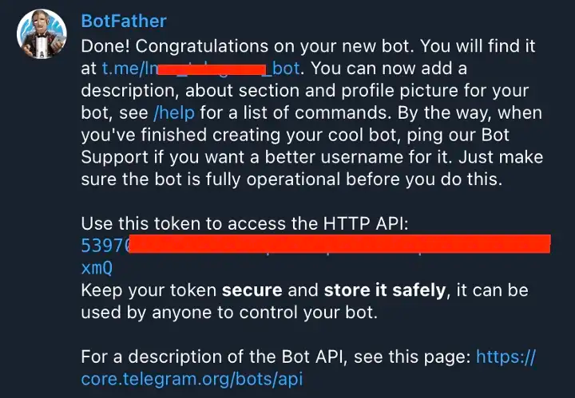

# Telegram Bot

Telegram Bot will send auto notification to the group or channel once the alert will be triggered

### 1. Create A Telegram Bot Using Telegram’s BotFather

1. Open your telegram app and search for BotFather. (A built-in Telegram bot that helps users create custom Telegram bots)
2. Type /newbot to create a new bot
3. Give your bot a name & a username
4. Copy your new Telegram bot’s API token

### 2. Configure Harp Telegram Bot

1. Go to `Menu` and choose `Bots`

2. You will see the full list of available Bots

There are two different statuses:
- Yellow: Bot is not configured, and you cannot use it in [Scenarios](../scenarios-overview/scenarios-overview.md)
- Green: Bot is configured

3. Choose Telegram Bot

4. Specify `Bot Name` and `Bot API Token` that was created in the previous section and press `Save`

5. Now you can go to the [Harp Scenarios settings](../scenarios-overview/telegram.md), and you can add Telegram action to your scenario

### Test Telegram Bot

In Bot settings you can specify Telegram Chat ID ([How to find it](../scenarios-overview/telegram#2-how-to-find-your-chat-id)) that should receive test notification and press the button `Test`

