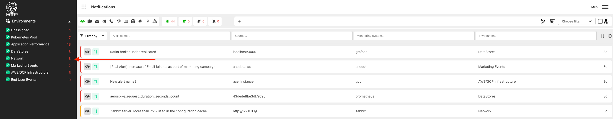
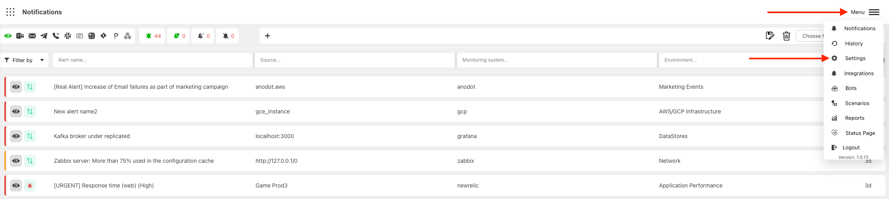
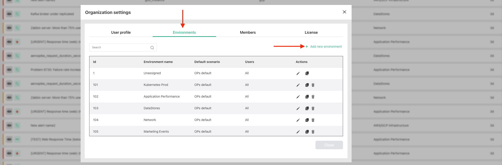
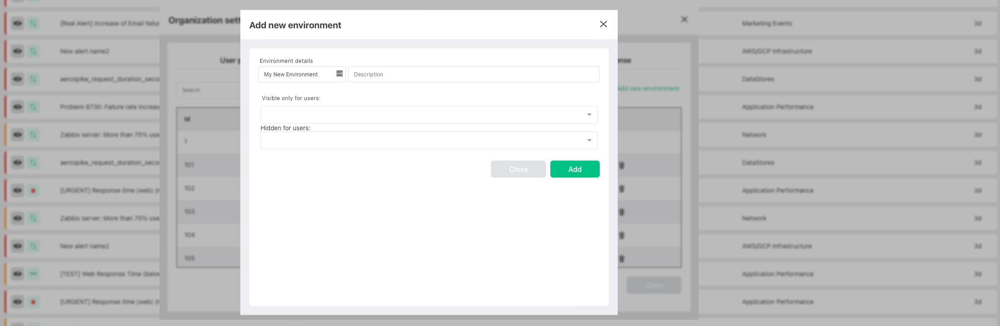
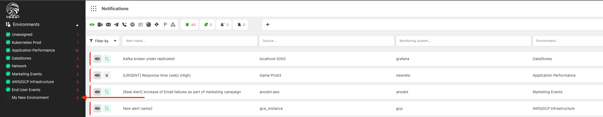

# Environments

You can use Harp environments to logically separate your alerts from different sources

### How to configure:

1. Go to `Menu` and choose `Settings`

2. Choose Environment tab and press create new

3. Specify the name of the environment and the list of users who can see it. By default, it will be visible for all

4. New environment will be added to the left side panel

