# Home page overview

Main page will allow you to review and manage your alerts

### Environments
On the left side your will see the list of the logical folders that help you to separate alerts according to different criteria. For example alerts from Grafana should go to one environment and alert from Prometheus to another

How to configure [Environments](environments-overview.md)

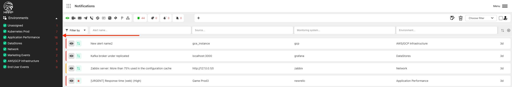

### Notification channels
It allows to review the list of active alerts

The list of channels you can specify in [Scenarios](scenarios-overview)

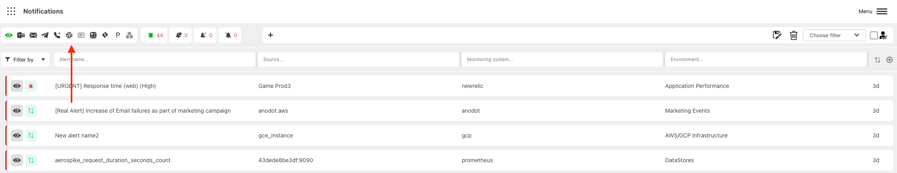

### Alert state
In this section you can filter alerts by different states:

- **Active** - alert was triggered
- **Handle** - someone started working with this alert
- **Snooze** - alert was snooze for some period of time
- **Acknowledged** - alert was acknowledged and will appear in active tab once alert disappear and appear again

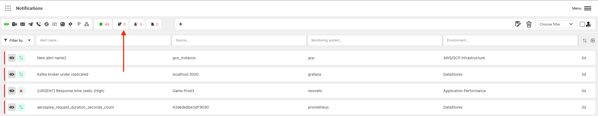

### Alert badges
Badges will help you to identify the importance of the alert:

- **Urgent** - contain `URGENT` word in alert name
- **Flapping** - appears more than 5 times per hour
- **New** - first time appear in Harp
- **Test** - contain `TEST` word in alert name

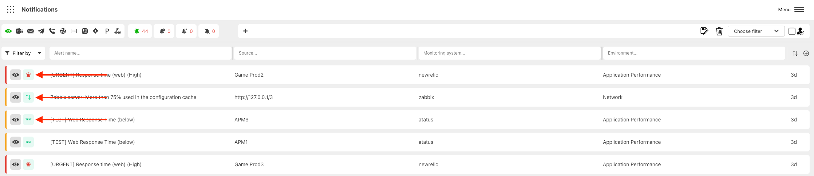

### Quick filter by severity

Display alerts with specific severity

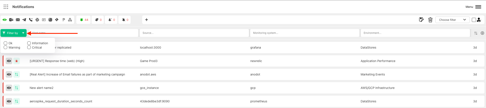

### User custom filters
Filter your alerts according to specific conditions

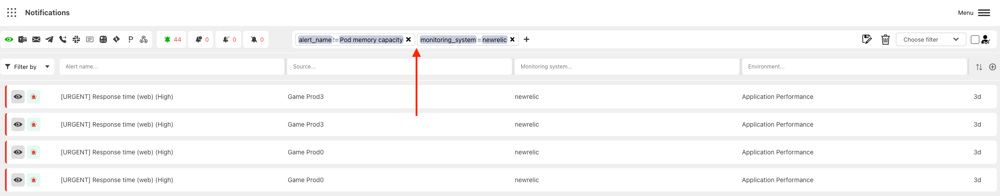

You can save your filters and make it **private** (only you can see it) or **public** (all your users will be able to use it)

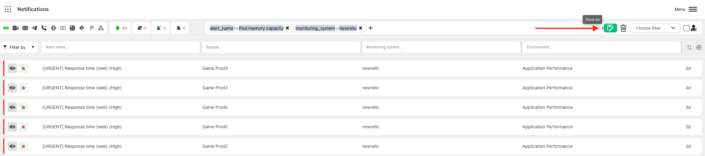

### Assigned to me

Show only alerts that were assigned to you

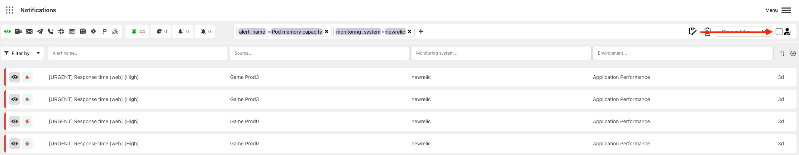

### Sort alerts by time

By default, the newest alerts will appear on top. But you can make it vise versa

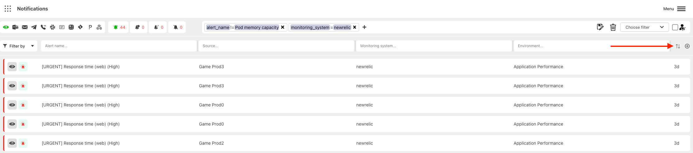

### Search

On top of each column you have the search field, and you can use it to find the specific alert

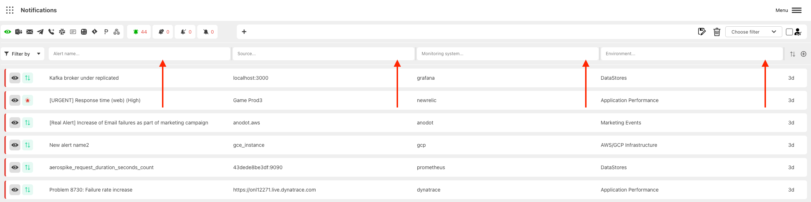

### Add / Delete columns

You can add or remove columns from the main view. All columns will be automatically registered in the system

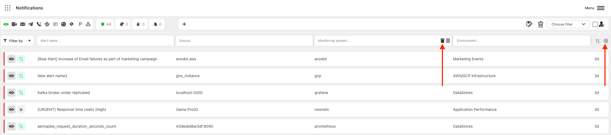

### Group alerts by specific columns

Alerts with the same column(s) name will be grouped together

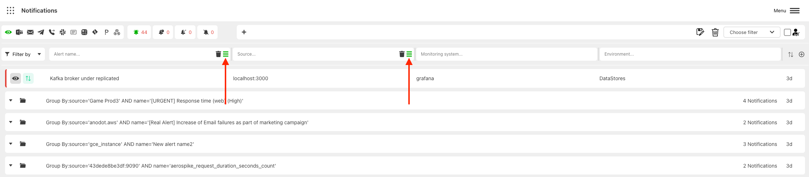

### Resize column width

You can specify the width of each column

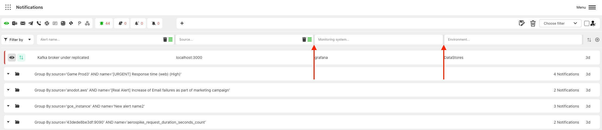

### Hide side panel

You can hide the left side panel with Environments

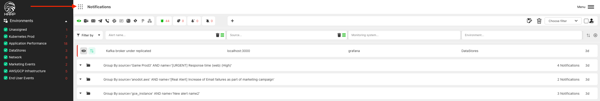