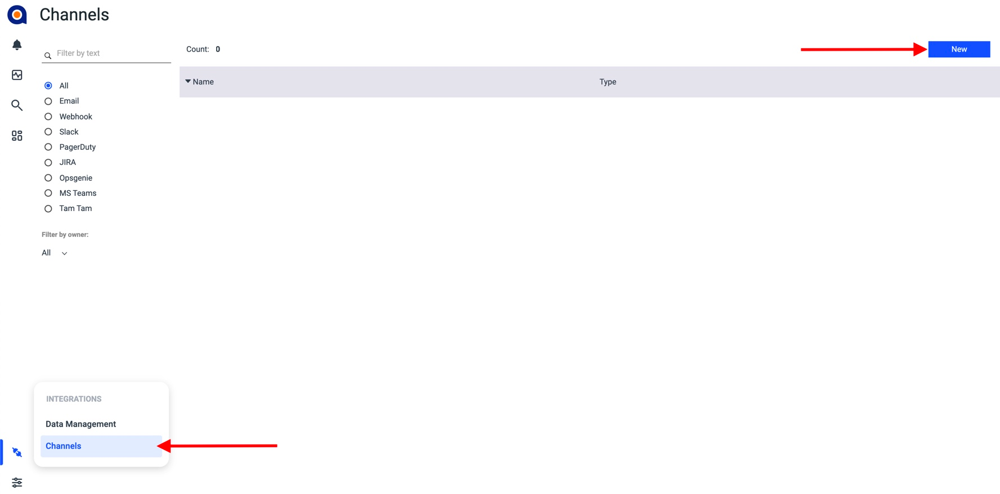
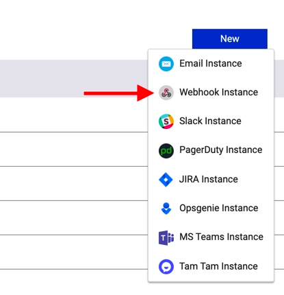
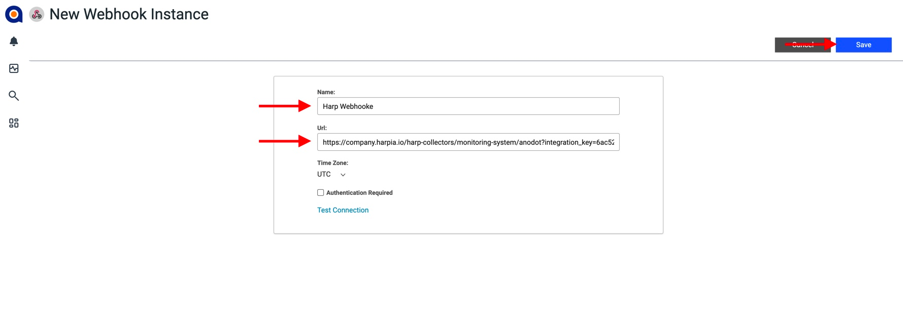
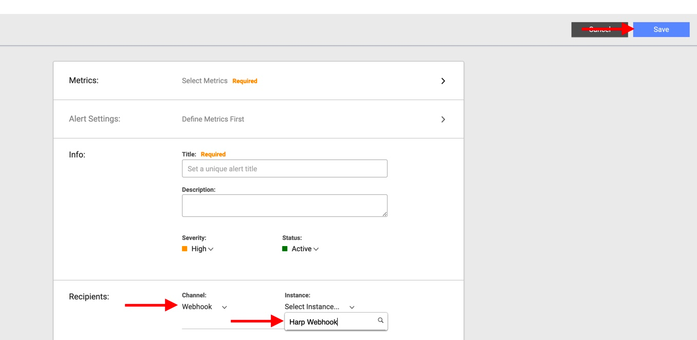

# Anodot

Anodot detects and groups anomalies across silos to help you find and fix business incidents in real time

### How it works
Anodot sends alerts to the Incident management system endpoint via HTTP webhook

### How to register new integration in Harp

Follow [these steps](../integration.md) to register a new integration in Harp Platform

### How to configure in Anodot

#### 1. Go to “Channels” and click on “New”



#### 2. Choose “Webhook Instance” from the list



#### 3. Specify details about your new webhook and click on “Save”

```
Webhook Name: Harp Webhook
URL: <URL Generated in Harp Integrations>
```



#### 4. Attach Harp Webhook to your alert



#### 5. You are good to go! Your Datadog integration is completed, and you can start working with alerts in Harp

### Additional info
- [How to register new integration in Harp](../integration.md)
- [List of all integration](../category/incoming-integrations)
- [More details about Anodot](https://www.anodot.com/)


