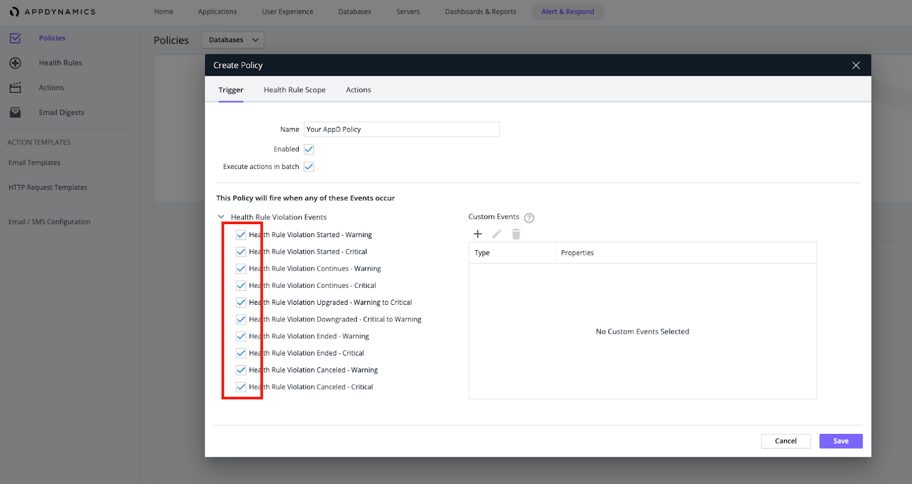

# AppDynamics

AppDynamics is dedicated to making it easier for software engineers to instrument everything and better understand their digital systems

### How it works
AppDynamics uses Webhook to send alerts to Harp endpoint

### How to register new integration in Harp

Follow [these steps](../integration.md) to register a new integration in Harp Platform

### How to configure in AppDynamics

#### 1. Create new “HTTP Request Template”

**Name:** `Harp`
**Method:** `POST`
**Raw URL:** [How to find URL](../integration#how-to-find-url-for-integration)


#### 2. Add Payload which should be sent to Harp endpoint when Health Rule will be triggered

```json
{
      "account_name":                  "${account.name}",
      "account_id":                    "${account.id}",
      "action_name":                   "${action.name}",
      "action_id":                     "${action.id}",
      "action_trigger_time":           "${action.triggerTime}",
      "controller_link_url":           "${controllerUrl}",
      "clamped":                       ${clamped},
      "clamp_limit":                   ${clampLimit},
      "from_web_hook":                 true,
    #if (${notes})
      "notes":                         "${notes}",
    #end
      "policy_name":                   "${policy.name}",
      "policy_id":                     "${policy.id}",
      "policy_digest":                 ${policy.digest},
      "full_events_list":              [
    #foreach(${event} in ${fullEventList})#if (${event.healthRuleEvent})
      {
        "health_rule_event":           ${event.healthRuleEvent},
        "health_rule_violation_event": ${event.healthRuleViolationEvent},
        "health_rule_id":              ${event.healthRule.id},
        "health_rule_name":            "${event.healthRule.name}",
        "incident_id":                 "${event.incident.id}",
        "incident_name":               "${event.incident.name}",
        "appd_event_type":               "health-rule",
        "display_name":                "${event.displayName}",
        "app_id":                      ${event.application.id},
        "app_name":                    "${event.application.name}",
        "bt_performance_event":        ${event.btPerformanceEvent},
        "deep_link_url":               "${event.deepLink}",
        "event_type":                  "$event.eventType",
        "event_message":               "${event.eventMessage.replaceAll("\\<[^>]*\\>","")}",
        "event_type_key":              "${event.eventTypeKey}",
        "event_time":                  "${event.eventTime}",
        "guid":                        "${event.guid}",
    #if (${event.node_name})
        "node_name":                   "${event.node.name}",
        "node_id":                     "${event.node.id}",
    #end
        "summary_message":             "${event.summaryMessage.replaceAll("\\<[^>]*\\>","")}",
        "severity":                    "${event.severity}",
        "tag":                         "bigpanda-api",
    #if (${event.tier_name})
        "tier_name":                   "${event.tier.name}",
        "tier_id":                     "${event.tier.id}",
    #end
        "affected_entities":           [
    #foreach(${entity} in ${event.affectedEntities})
            {
              "id":                    ${entity.id},
              "name":                  "${entity.name}",
              "type":                  "${entity.entityType}"
            }#if ($velocityHasNext), #end
    #end
        ]
      }#if ($velocityHasNext), #end
    #end
    #end
      ]
    }
```


#### 3. Response Handling Criteria and Settings should look like on the screenshot


#### 4. Now need to create new Action and attach it to that Template

- Step 1


- Step 2


- Step 3


#### 5. Now you need to attach AppD Policy to recently created Action

- Step 1


- Step 2



- Step 3


- Step 4


- Step 5


#### 6. You are good to go! Your Appdynamics integration is completed, and you can start working with alerts in Harp

### Additional info
- [How to register new integration in Harp](../integration.md)
- [List of all integration](../category/incoming-integrations)
- [More details about AppDynamics](https://www.appdynamics.com/)


