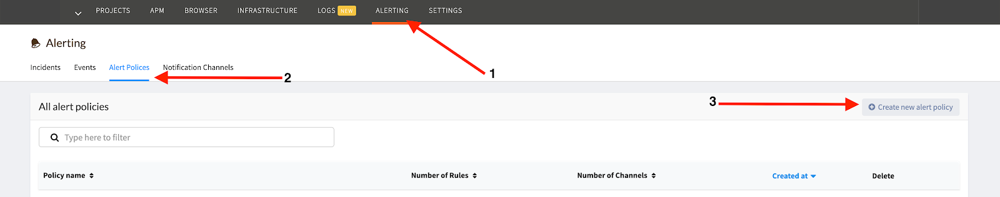

# Atatus

Performance Monitoring for your entire software stack. Get deeper insight into performance issues and crashes using Atatus's performance monitoring and error

### How it works
Atatus uses webhook to send alerts to Harp endpoint

### How to register new integration in Harp

Follow [these steps](../integration.md) to register a new integration in Harp Platform

### How to configure in Atatus

#### 1. Go to Notification Channels

#### 2. Create new channel

**Channel Type:** `Webhook`
**Channel Name:** `Harp`
**URL:** [How to find URL](../integration#how-to-find-url-for-integration)

#### 3. Connect “Alert Policies” to Notification Channel

#### 4. Add Harp notification channel to all your policies

#### 5. All alerts which were pointed to that Alert Policy should be sent to Harp

#### 6. You are good to go! Your Atatus integration is completed, and you can start working with alerts in Harp

### Additional info
- [How to register new integration in Harp](../integration.md)
- [List of all integration](../category/incoming-integrations)
- [More details about Atatus](https://www.atatus.com/)

