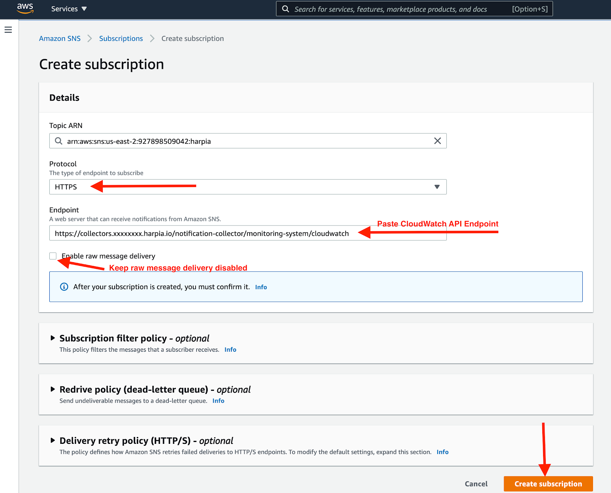

# AWS CloudWatch

Amazon CloudWatch collects and visualizes real-time logs, metrics, and event data in automated dashboards to streamline your infrastructure and application

### How it works
Harp and AWS Cloudwatch integration allows you to forward AWS Cloudwatch alerts into Harp to visualize notification in the central place or notify relevant people.

This guide assumes that you’ve already set up CloudWatch to send alarms to a queue in SNS and that you’re receiving them through some other means, such as email. If you need more information on how to create a new alarm please consult Amazon’s documentation.

### How to register new integration in Harp

Follow [these steps](../integration.md) to register a new integration in Harp Platform

### How to configure in AWS CloudWatch

#### 1. From the main AWS Management Console, navigate to your SNS control panel by searching for “SNS”.

#### 2. From the SNS dashboard, choose Topics and then select Create topic.

#### 3. Specify name of the topic and choose Standard type

#### 4. Once you’ve created your Harp related Topic, you’ll be required to create a subscription to the new Topic.

#### 5. Define protocol and endpoint

**Protocol:** `HTTPS`
**Endpoint:** [How to find URL](../integration#how-to-find-url-for-integration)

#### 6. After few seconds you should see the status as Confirmed

#### 7. You are good to go! Your CloudWatch integration is completed, and you can start working with alerts in Harp

### How to test

Once your subscription is confirmed, select Publish message. In the following steps, you’ll be able to send a test notification to Harp.

Generate test notification

After a while you should see test notification in Harp Console

### Additional info
- [How to register new integration in Harp](../integration.md)
- [List of all integration](../category/incoming-integrations)
- [More details about AWS Cloudwatch](https://aws.amazon.com/cloudwatch/)

