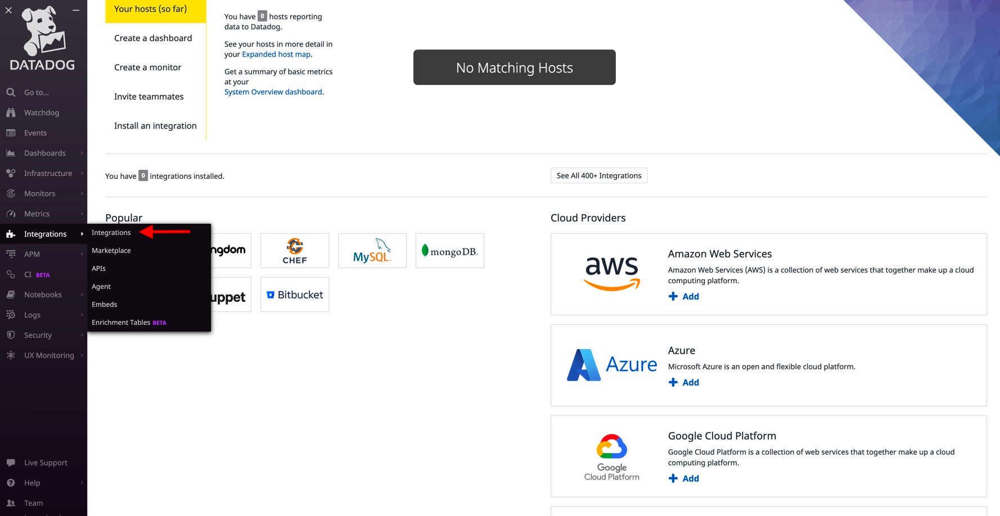
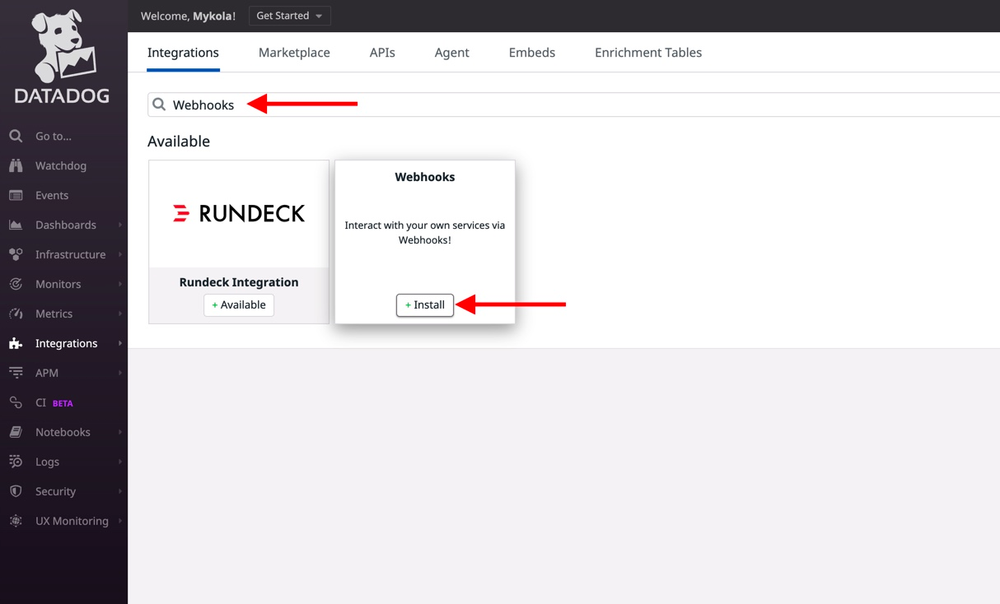
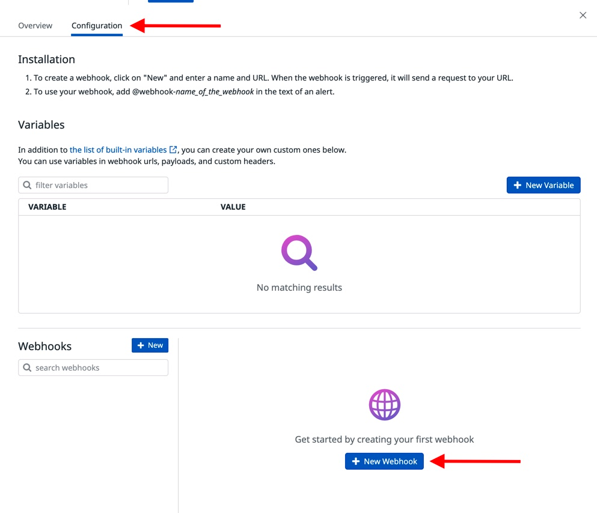
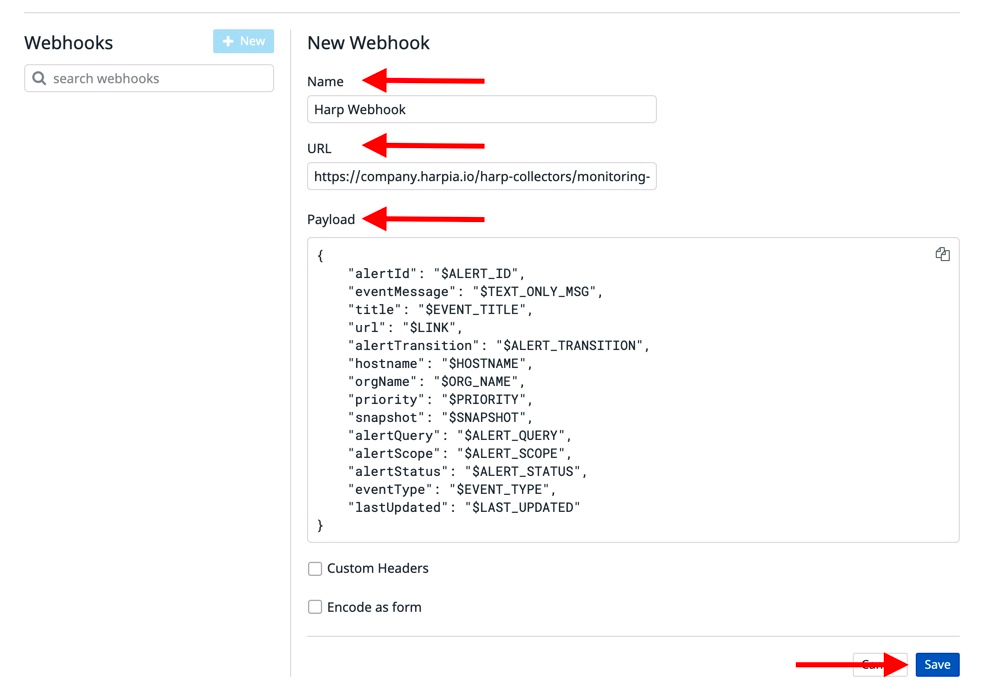

# Datadog

Datadog is a data observability service for cloud-scale applications, providing monitoring of servers, databases, tools, and services, through a SaaS-based

### How it works
Datadog sends alerts to the Incident management system endpoint via HTTP webhook

### How to register new integration in Harp

Follow [these steps](../integration.md) to register a new integration in Harp Platform

### How to configure in Datadog

#### 1. Go to “Integrations”



#### 2. Choose “webhook” from the list and click on “Install”



#### 3. Scroll to the bottom of the page. Click on “New Webhook” to add a new Webhook URL



#### 4. Specify details about your new webhook and click on “Save”

```
Webhook Name: Harp Webhook
URL: <URL Generated in Harp Integrations>
Payload:
{
    "alertId": "$ALERT_ID",
    "eventMessage": "$TEXT_ONLY_MSG",
    "title": "$EVENT_TITLE",
    "url": "$LINK",
    "alertTransition": "$ALERT_TRANSITION",
    "hostname": "$HOSTNAME",
    "orgName": "$ORG_NAME",
    "priority": "$PRIORITY",
    "snapshot": "$SNAPSHOT",
    "alertQuery": "$ALERT_QUERY",
    "alertScope": "$ALERT_SCOPE",
    "alertStatus": "$ALERT_STATUS",
    "eventType": "$EVENT_TYPE",
    "lastUpdated": "$LAST_UPDATED"
}
```



Once the Webhook has been configured, ensure that the same is also selected as a channel within Notify your team in the Monitor’s configuration.

#### 5. You are good to go! Your Datadog integration is completed, and you can start working with alerts in Harp

### Additional info
- [How to register new integration in Harp](../integration.md)
- [List of all integration](../category/incoming-integrations)
- [More details about Datadog](https://www.datadoghq.com/)


