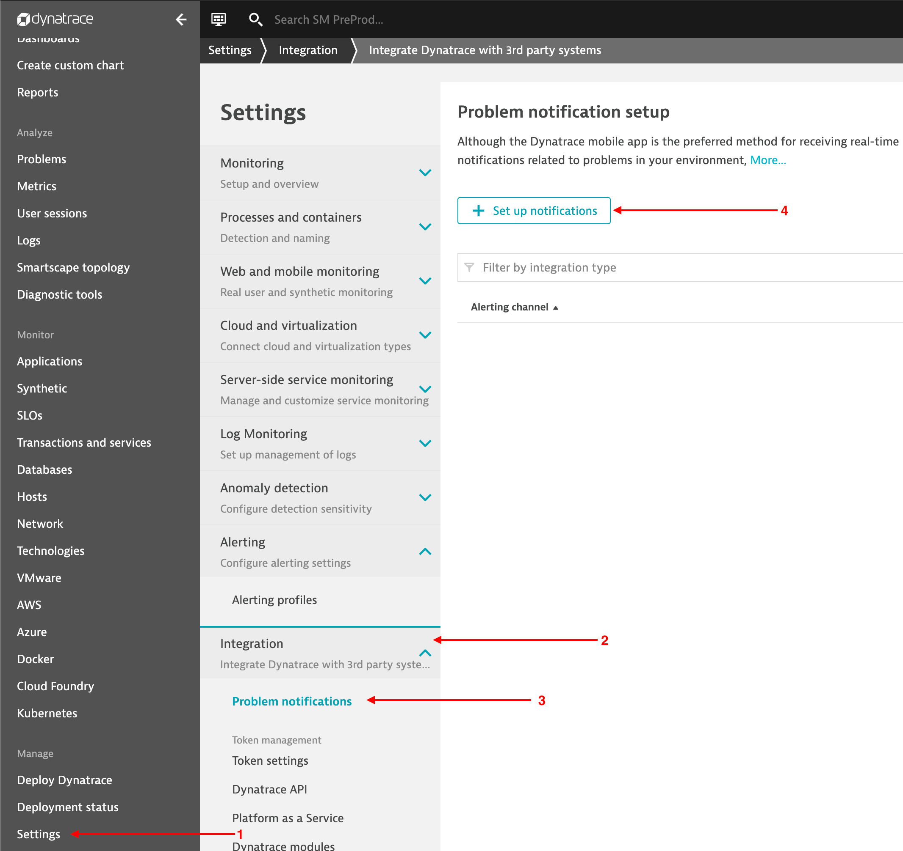
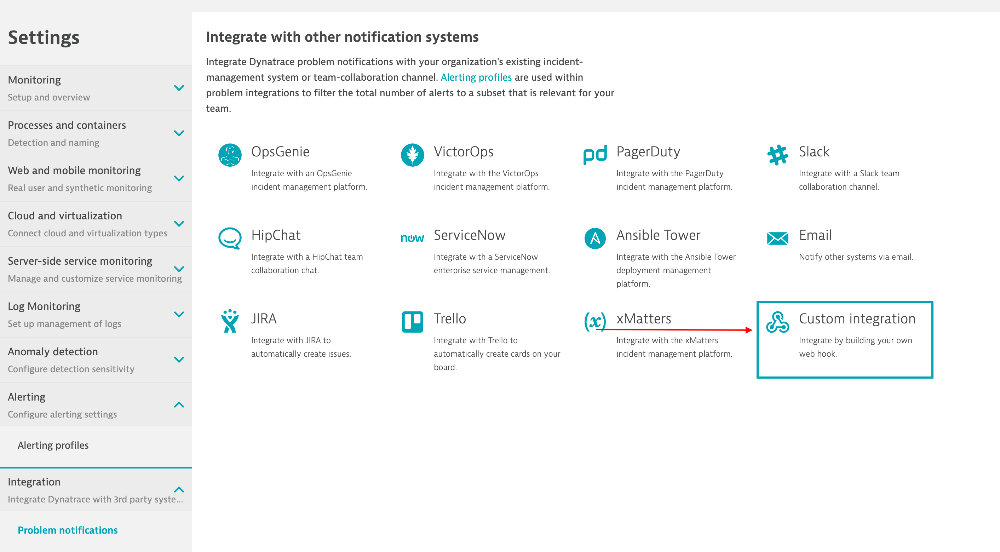
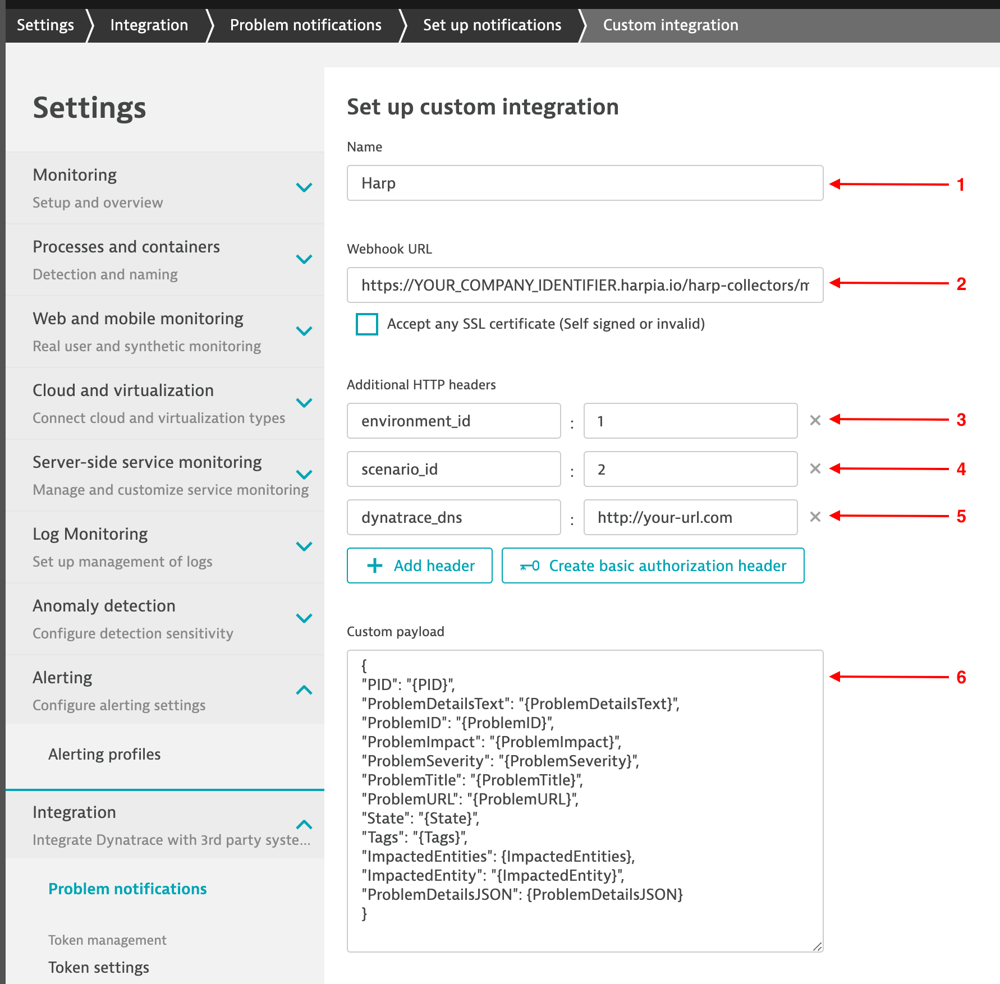
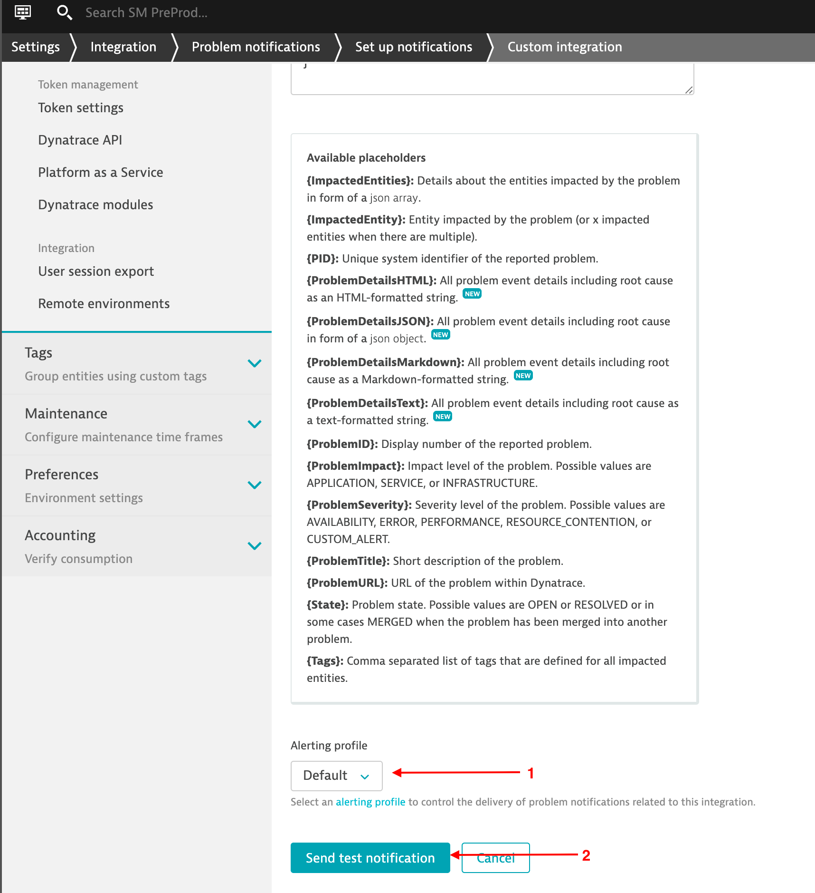

# Dynatrace

Dynatrace is an American technology company that produces a software intelligence platform based on artificial intelligence to monitor and optimize application performance and development, IT infrastructure, and user experience for businesses and government agencies throughout the world.

### How it works
Dynatrace uses Webhook to send alerts to Harp endpoint

### How to register new integration in Harp

Follow [these steps](../integration.md) to register a new integration in Harp Platform

### How to configure in Dynatrace

#### 1. Go to “Problem notification setup” page



#### 2. Choose custom integration



#### 3. Configure custom integration according to the settings below

**Name:** `Harp`
**Webhook URL:** [How to find URL](../integration#how-to-find-url-for-integration)
**dynatrace_dns:** http://your-dynatrace-url.com
**Custom payload:**
```json
{
"PID": "{PID}",
"ProblemDetailsText": "{ProblemDetailsText}",
"ProblemID": "{ProblemID}",
"ProblemImpact": "{ProblemImpact}",
"ProblemSeverity": "{ProblemSeverity}",
"ProblemTitle": "{ProblemTitle}",
"ProblemURL": "{ProblemURL}",
"State": "{State}",
"Tags": "{Tags}",
"ImpactedEntities": {ImpactedEntities},
"ImpactedEntity": "{ImpactedEntity}",
"ProblemDetailsJSON": {ProblemDetailsJSON}
}
```



#### 4. Choose alerting profile and save notification



#### 5. You are good to go! Your Dynatrace integration is completed, and you can start working with alerts in Harp

### Additional info
- [How to register new integration in Harp](../integration.md)
- [List of all integration](../category/incoming-integrations)
- [More details about Dynatrace](https://www.dynatrace.com/)


