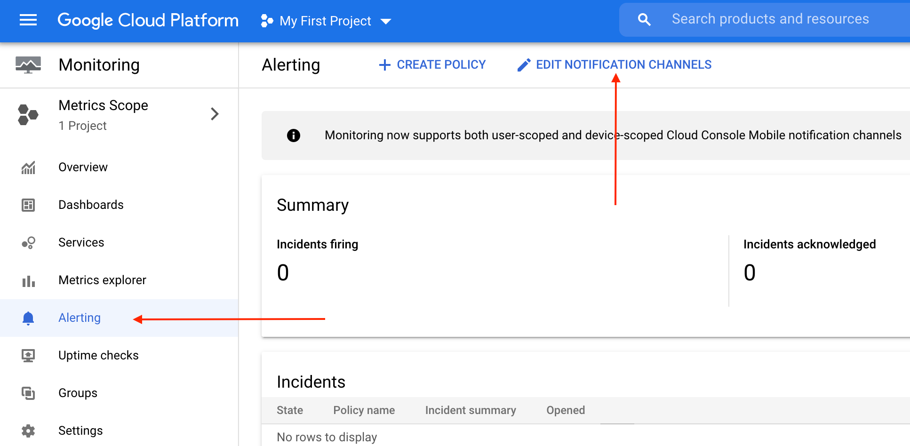
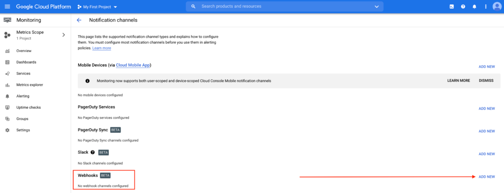
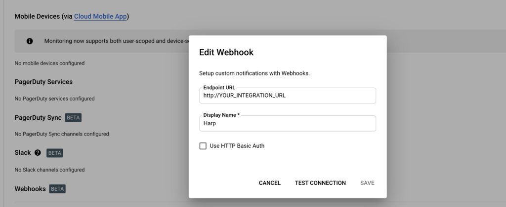
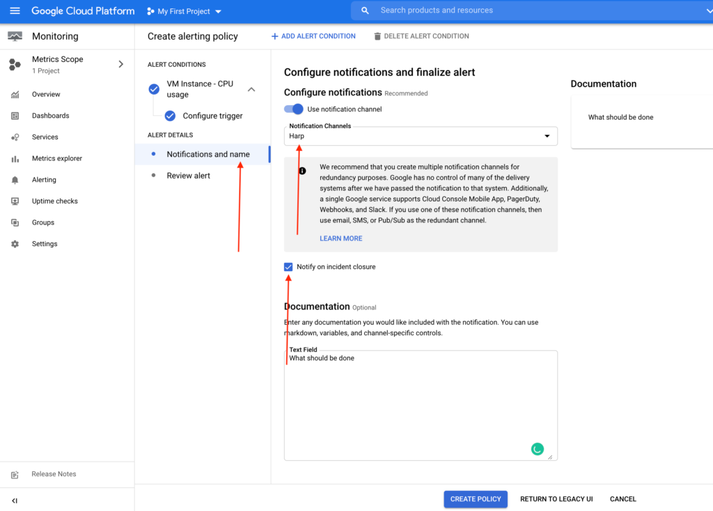

# GCP

Google Cloud's operations suite (formerly Stackdriver) · Collect metrics, logs, and traces across Google Cloud and your applications

### How it works
GCP uses webhook to send alerts to Harp endpoint

### How to register new integration in Harp

Follow [these steps](../integration.md) to register a new integration in Harp Platform

### How to configure in GCP

#### 1. Go to Alerting

#### 2. Create a new Notification channel

#### 3. Add Webhook URL from [registered integration in Harp](../integration.md)

**Note:** `YOUR_INTEGRATION_URL` - you can find it in Harp console when you register integration for it

#### 4. Attach alerts to the recently created notification channel

#### 5. You are good to go! Your GCP integration is completed, and you can start working with alerts in Harp

### Additional info
- [How to register new integration in Harp](../integration.md)
- [List of all integration](../category/incoming-integrations)
- [More details about GCP](https://cloud.google.com/)

