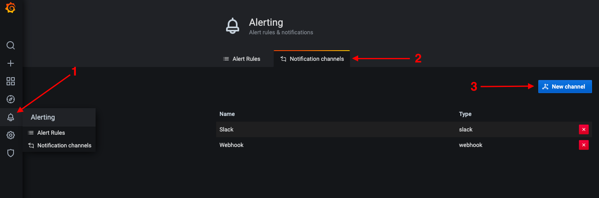
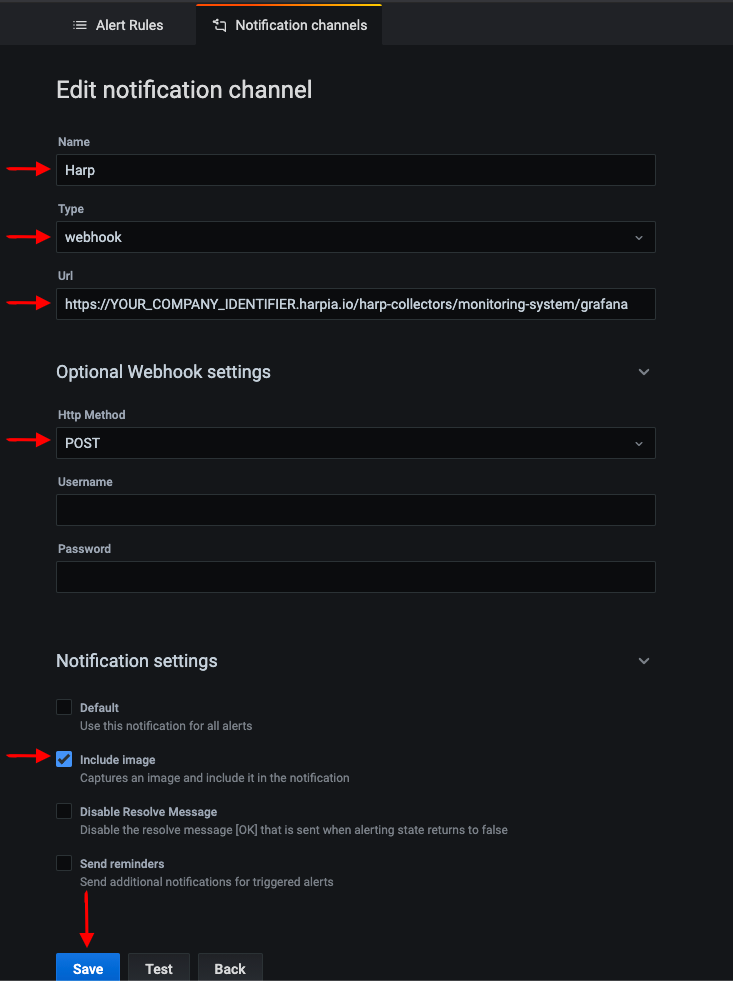
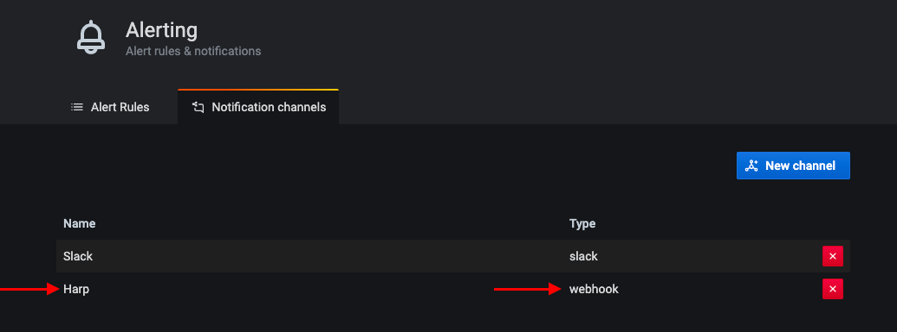
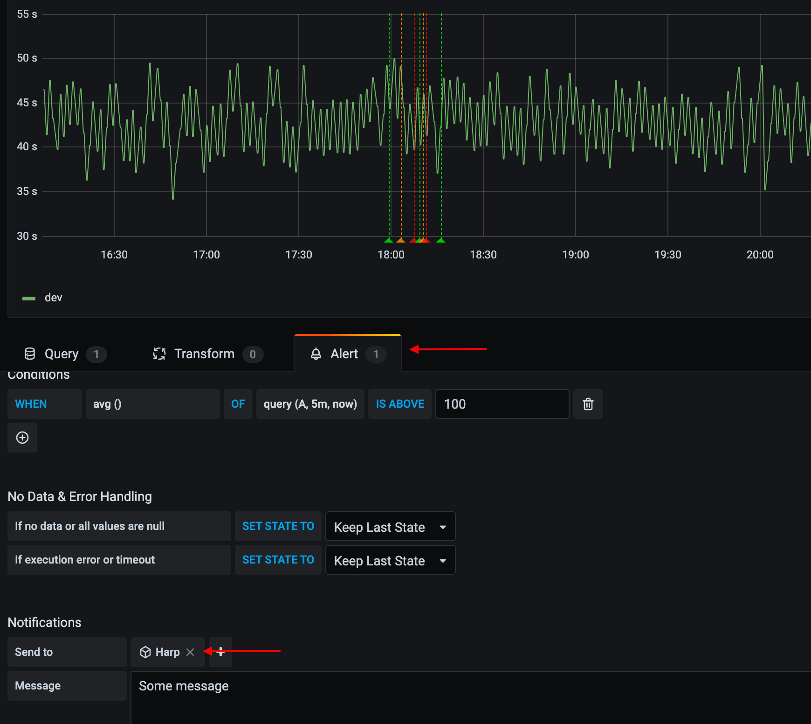

# Grafana

This article will describe how you can connect your monitoring systems to Harp

### How it works
Grafana uses Webhook to send alerts to the Harp endpoint

### How to register new integration in Harp

Follow [these steps](../integration.md) to register a new integration in Harp Platform

### How to configure in Grafana

#### 1. Go to “Notification Channels”

#### 2. Create a new Grafana channel

You should specify:
- **Name**: `Harp`
- **Type**: `webhook`
- **URL**: [How to find URL](../integration#how-to-find-url-for-integration)
- **Http Method**: `POST`
- **Include Image**: `True`

#### 3. After save, you should see the Harp channel in the list

#### 4. Add Harp channel to your alert

#### 5. You are good to go! Your Grafana integration is completed, and you can start working with alerts in Harp

### Additional info
- [How to register new integration in Harp](../integration.md)
- [List of all integration](../category/incoming-integrations)
- [More details about Prometheus](https://grafana.com/)