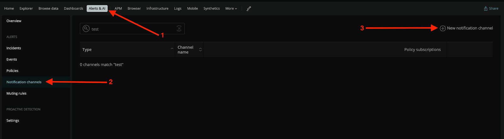
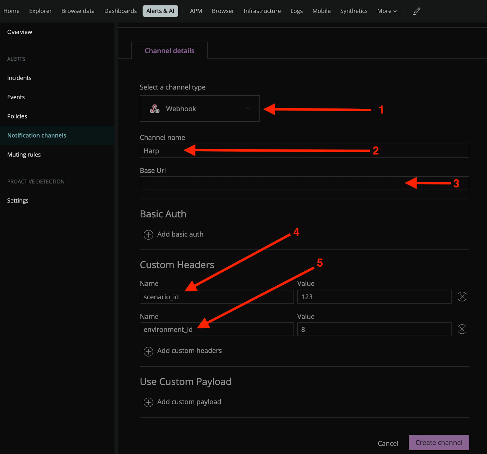
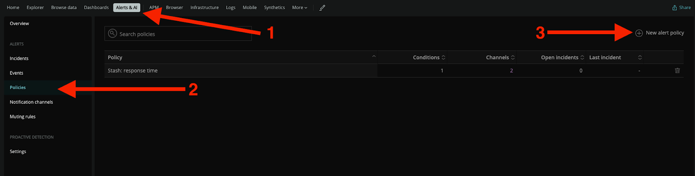
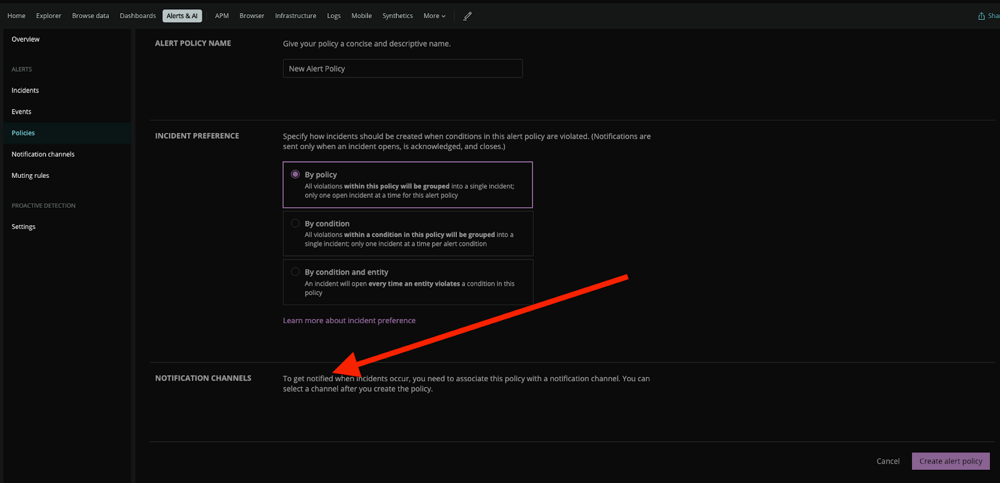
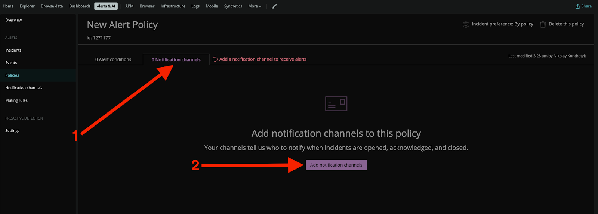
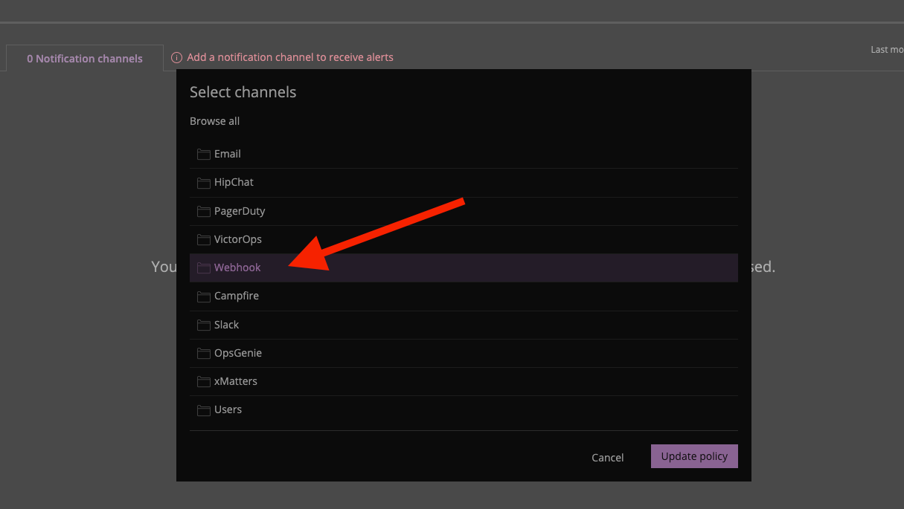
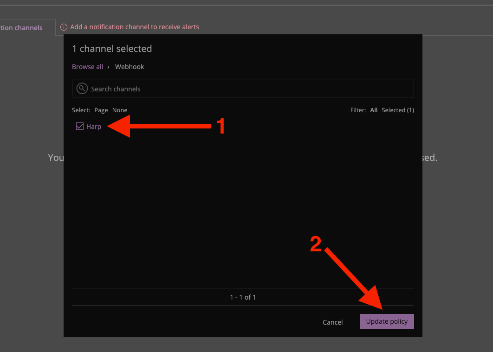
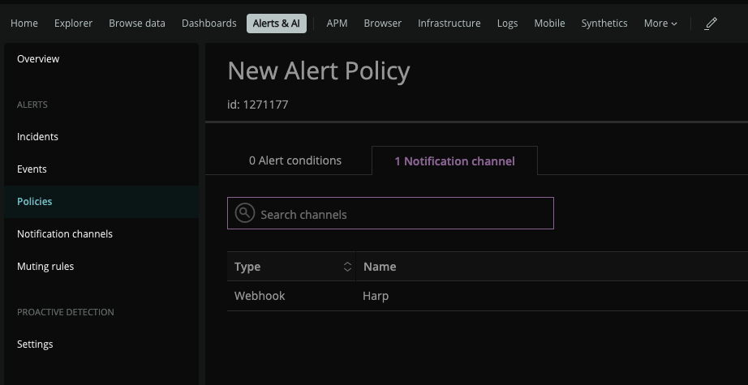

# NewRelic

New Relic is dedicated to making it easier for software engineers to instrument everything and better understand their digital systems

### How it works
NewRelic uses Webhook to send alerts to Harp endpoint

### How to register new integration in Harp

Follow [these steps](../integration.md) to register a new integration in Harp Platform

### How to configure in New Relic

#### 1. Go to “Notifications channels”

#### 2. Create new channel

**Channel Type:** `Webhook`
**Channel Name:** `Harp`
**URL:** [How to find URL](../integration#how-to-find-url-for-integration)

#### 3. Connect “Alert Policies” to Notification Channel

#### 4. Create new alert policy

#### 5. Add recently created Harp notification channel to new alert policy

#### 6. Choose Webhook as a channel type

#### 7. Choose Harp channel and update the policy

#### 8. You should see 1 notification channel in your policy

#### 9. All alerts which were pointed to that Alert Policy should be sent to Harp

#### 10. You are good to go! Your New Relic integration is completed, and you can start working with alerts in Harp

### Additional info
- [How to register new integration in Harp](../integration.md)
- [List of all integration](../category/incoming-integrations)
- [More details about NewRelic](https://newrelic.com/)

