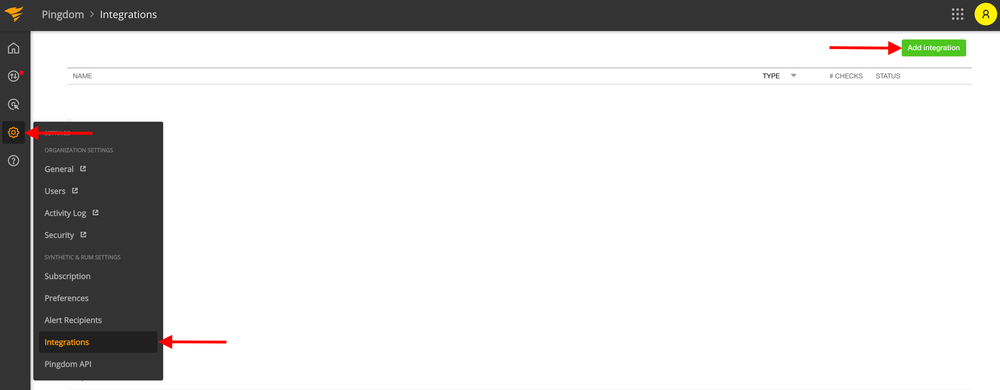
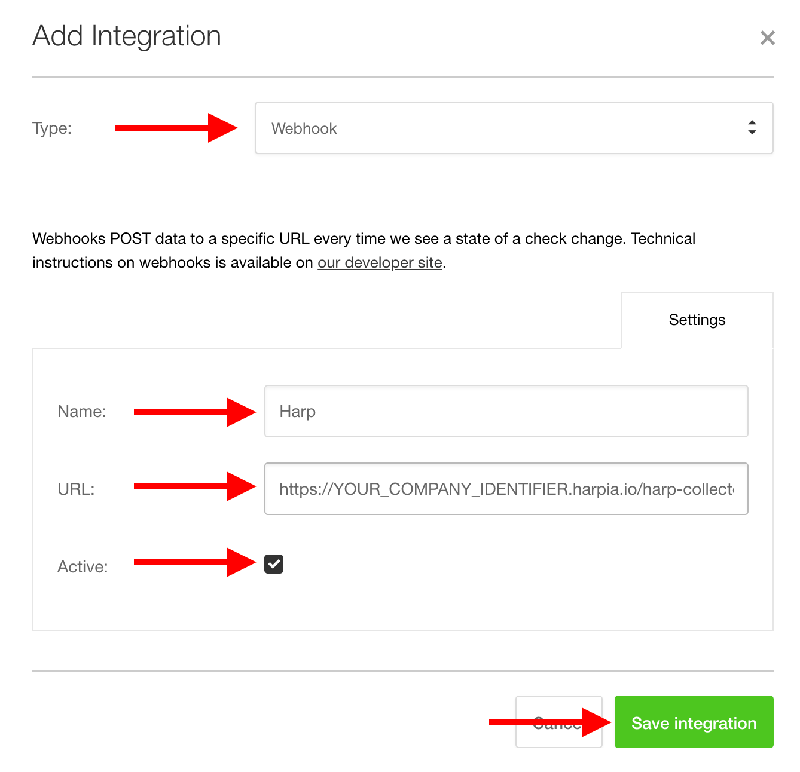
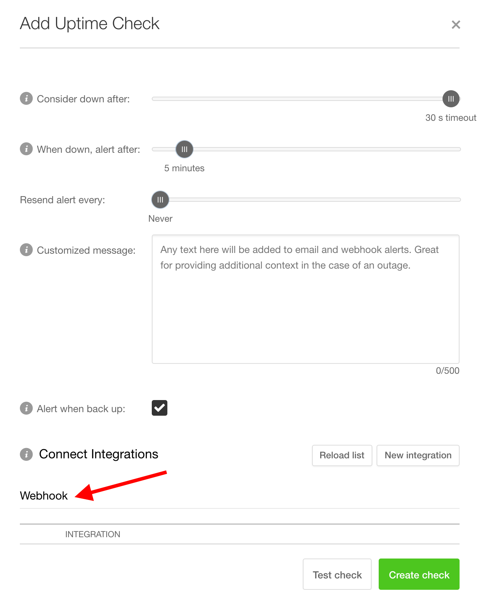

# Pingdom

Pingdom helps you provide excellent service and third-party proof of meeting key service objectives and SLAs with sharable and customizable reporting

### How it works
Pingdom uses Webhook to send alerts to Harp endpoint

### How to register new integration in Harp

Follow [these steps](../integration.md) to register a new integration in Harp Platform

### How to configure in Pingdom

#### 1. Go to Integration and add new one

#### 2. Configure custom integration according to the settings below

**Type:** `Webhook`
**Name:** `Harp`
**URL:** [How to find URL](../integration#how-to-find-url-for-integration)
**Active:** `True`

#### 3. After that you will be able to attach your Pingdom check to notification channel

#### 4. You are good to go! Your Pingdom integration is completed, and you can start working with alerts in Harp

### Additional info
- [How to register new integration in Harp](../integration.md)
- [List of all integration](../category/incoming-integrations)
- [More details about Pingdom](https://www.pingdom.com/)

