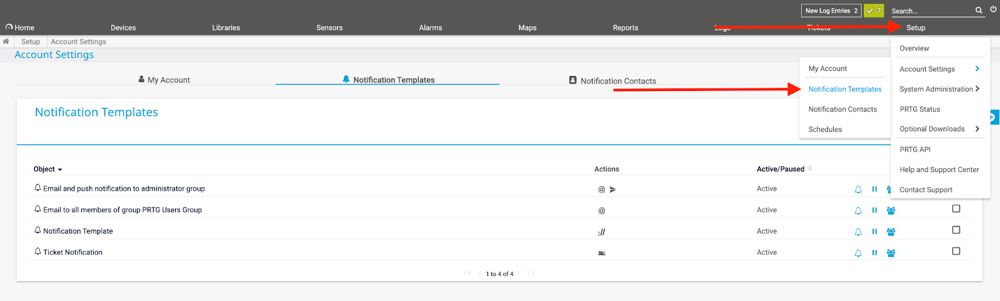
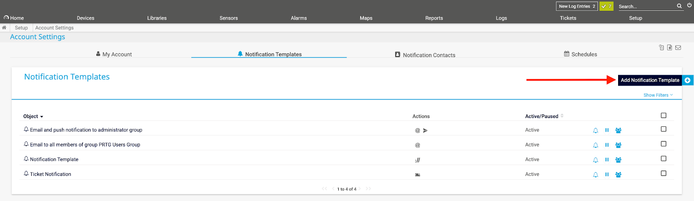
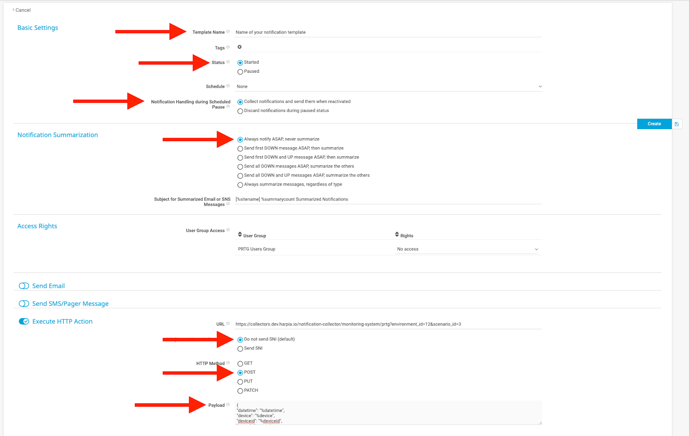
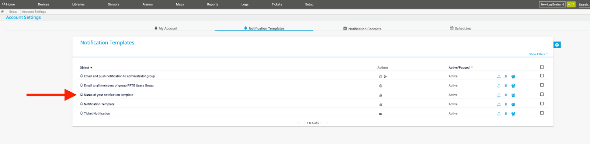
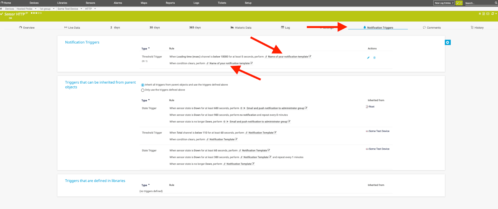

# PRTG

PRTG is network-monitoring software that can run on a Windows machine within your network and it can collect statistics from designated hosts such as routers, servers, switches and other important devices or applications.

### How it works
PRTG uses webhook to send alerts to Harp endpoint

### How to register new integration in Harp

Follow [these steps](../integration.md) to register a new integration in Harp Platform

### How to configure in PRTG

#### 1. Go to Notification Templates


#### 2. Create a new Notification Template



#### 3. Configure template according to the settings below

- Payload

    ```json
    {
      "datetime": "%datetime",
      "device": "%device",
      "deviceid": "%deviceid",
      "group": "%group",
      "home": "%home",
      "host": "%host",
      "lastmessage": "%lastmessage",
      "laststatus": "%laststatus",
      "lastvalue": "%lastvalue",
      "linkprobe": "%linkprobe",
      "linkdevice": "%linkdevice",
      "linksensor": "%linksensor",
      "location": "%location",
      "name": "%name",
      "priority": "%priority",
      "probe": "%probe",
      "programname": "%programname",
      "sensor": "%sensor",
      "server": "%server",
      "serviceurl": "%serviceurl",
      "shortname": "%shortname",
      "status": "%status"
    }
    ```

- URL

    You unique URL from registered Integration in Harp Platform

- Settings

    

#### 4. A new template should appear in your list



#### 5. Attach notification triggers to the recently created notification template



#### 6. You are good to go! Your PRTG integration is completed, and you can start working with alerts in Harp

### Additional info
- [How to register new integration in Harp](../integration.md)
- [List of all integration](../category/incoming-integrations)
- [More details about PRTG](https://www.paessler.com/prtg/prtg-network-monitor)


