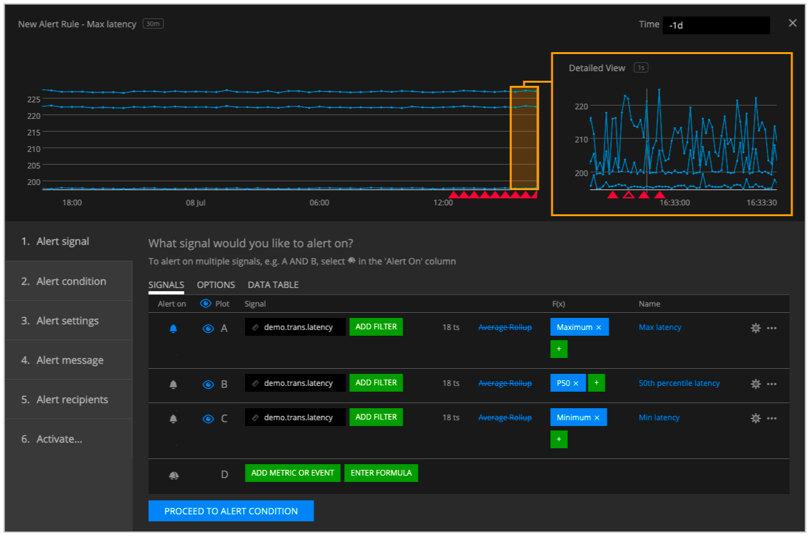
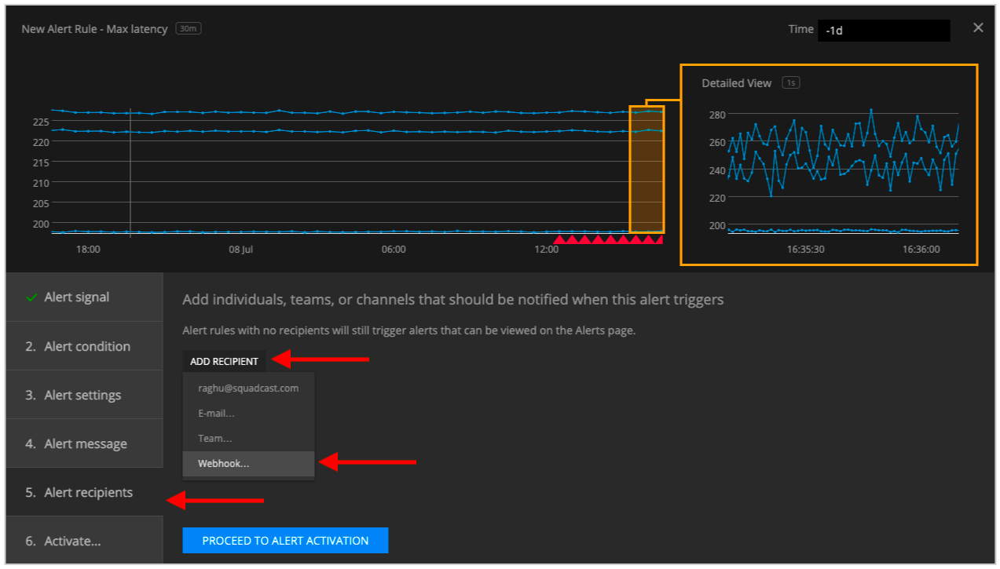
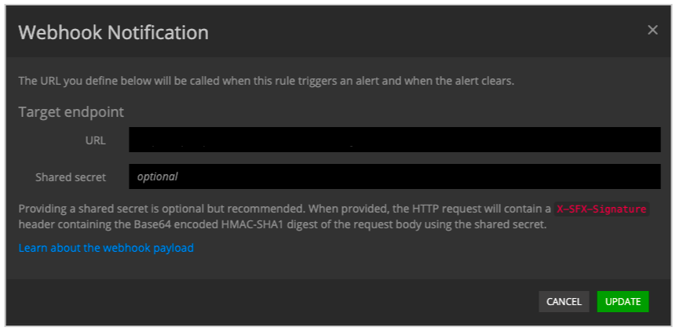

# SignalFx

SignalFx provides real-time analytics and operational intelligence for infrastructure, microservices, containers, serverless, and applications.

### How it works
SignalFx sends alerts to the Incident management system endpoint via HTTP webhook

### How to register new integration in Harp

Follow [these steps](../integration.md) to register a new integration in Harp Platform

### How to configure in SignalFx

#### 1. Go to SignalFx dashboard and create a new Alert Rule



#### 2. Got to “Alert Recipients”, click on “Add Recipient” and select Webhook



#### 3. Specify details about your new webhook and click on “Save”

```
URL: <URL Generated in Harp Integrations>
```



#### 4. You are good to go! Your SignalFx integration is completed, and you can start working with alerts in Harp

### Additional info
- [How to register new integration in Harp](../integration.md)
- [List of all integration](../category/incoming-integrations)
- [More details about SignalFx](https://www.splunk.com/)


