# Zabbix

Zabbix is a mature and effortless enterprise-class open source monitoring solution for network monitoring and application monitoring of millions of metrics

### How it works
Airbrake sends alerts to the Incident management system endpoint via HTTP webhook

### How to register new integration in Harp

Follow [these steps](../integration.md) to register a new integration in Harp Platform

### How to configure in Zabbix

#### 1. Add the macro {$ZABBIX.URL} with Zabbix frontend URL (for example http://192.168.7.123:8081)

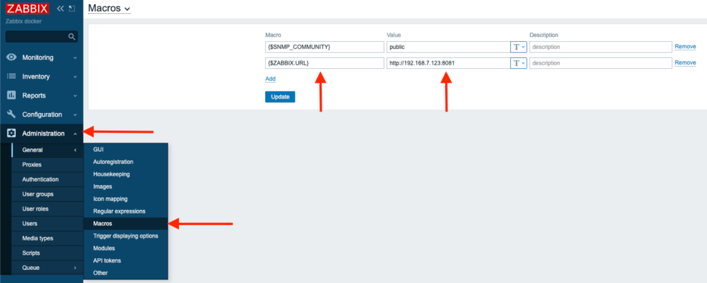

#### 2. Go to Media types under the Administration section

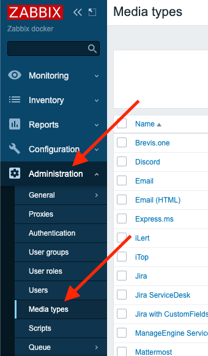

#### 3. Copy the contents of the below YAML snippet and save it in a file with .yaml extension

```yaml
zabbix_export:
  version: '5.4'
  date: '2020-10-16T09:33:50Z'
  media_types:
    -
      name: Harpia
      type: WEBHOOK
      parameters:
        -
          name: webhook_url
          value: '<Webhook URL from Harpia UI>'
        -
          name: eventack
          value: '{EVENT.ACK.STATUS}'
        -
          name: eventdate
          value: '{EVENT.DATE}'
        -
          name: eventid
          value: '{EVENT.ID}'
        -
          name: eventname
          value: '{ALERT.SUBJECT}'
        -
          name: eventtags
          value: '{EVENT.TAGS}'
        -
          name: eventtime
          value: '{EVENT.TIME}'
        -
          name: eventupdate
          value: '{EVENT.UPDATE.STATUS}'
        -
          name: eventvalue
          value: '{EVENT.VALUE}'
        -
          name: event_source
          value: '{EVENT.SOURCE}'
        -
          name: hostip
          value: '{HOST.IP}'
        -
          name: host_name
          value: '{HOST.NAME}'
        -
          name: severity
          value: '{EVENT.SEVERITY}'
        -
          name: trigger_description
          value: '{TRIGGER.DESCRIPTION}'
        -
          name: trigger_id
          value: '{TRIGGER.ID}'
        -
          name: triggeropdata
          value: '{EVENT.OPDATA}'
        -
          name: url
          value: '{$ZABBIX.URL}'
        -
          name: trigger_expression
          value: '{TRIGGER.EXPRESSION}'
        -
          name: trigger_hostgroup_name
          value: '{TRIGGER.HOSTGROUP.NAME}'
        -
          name: trigger_status
          value: '{TRIGGER.STATUS}'
        -
          name: trigger_name
          value: '{TRIGGER.NAME}'
      script: |
        try {

            var params = JSON.parse(value),
                req = new HttpRequest(),
                fields = {},
                resp = '';

            // Correspondence between the Harpia and Zabbix severity level

            if (typeof params.HTTPProxy === 'string' && params.HTTPProxy.trim() !== '') {
                req.setProxy(params.HTTPProxy);
            }

            if (isNaN(parseInt(params.eventid)) || params.eventid < 1) {
                throw 'incorrect value for variable "eventid". The value must be a positive number.';
            }

            if ([0, 1, 2, 3].indexOf(parseInt(params.event_source)) === -1) {
                throw 'Incorrect "event_source" parameter given: "' + params.event_source + '".\nMust be 0-3.';
            }
            // Check {EVENT.VALUE} for trigger-based and internal events.
            if (params.eventvalue !== '0' && params.eventvalue !== '1'
                && (params.event_source === '0' || params.event_source === '3')) {
                throw 'Incorrect "eventvalue" parameter given: "' + params.eventvalue + '".\nMust be 0 or 1.';
            }

            if (params.event_source === '0') {
                if (params.host_name.length < 1) {
                    throw 'incorrect value for variable "host_name". The value must be a non-empty string.';
                }
                if (isNaN(parseInt(params.trigger_id)) || params.trigger_id < 1) {
                    throw 'incorrect value for variable "trigger_id". The value must be a positive number.';
                }
                if (params.eventack != 'Yes' && params.eventack != 'No') {
                    throw 'incorrect value for variable "eventack". The value must be Yes or No.';
                }
                if (isNaN(parseInt(params.eventupdate)) || (params.eventupdate < 0 || params.eventupdate > 1)) {
                    throw 'incorrect value for variable "eventupdate". The value must be 0 or 1.';
                }
            }

            req.addHeader('Content-Type: application/json');

            if (((params.eventvalue == 1) && (params.eventupdate == 0)) || params.event_source !== '0') {
                fields.event_action = 'trigger';
            }
            else if ((params.eventvalue == 1) && (params.eventupdate == 1) && (params.eventack == 'Yes'))
                fields.event_action = 'acknowledge';
            else if (params.eventvalue == 0)
                fields.event_action = 'resolve';
            else
                throw 'incorrect values. Update message without ack will not be sent.';

            fields.host_name = params.host_name;
            fields.trigger_severity = params.severity;
            fields.eventname = params.eventname;
            fields.trigger_expression = params.trigger_expression;
            fields.source = params.url;
            fields.trigger_description = params.trigger_description;
            fields.trigger_id = params.trigger_id;
            fields.trigger_hostgroup_name = params.trigger_hostgroup_name;
            fields.trigger_status = params.trigger_status;
            fields.event_id = params.eventid;
            fields.eventack = params.eventack;
            fields.eventdate = params.eventdate;
            fields.eventtags = params.eventtags;
            fields.eventtime = params.eventtime;
            fields.eventupdate = params.eventupdate;
            fields.eventvalue = params.eventvalue;
            fields.event_source = params.event_source;
            fields.hostip = params.hostip;
            fields.triggeropdata = params.triggeropdata;
            fields.trigger_name = params.trigger_name;


            Zabbix.log(4, '[Harpia Webhook] Sending request:' + JSON.stringify(fields));
            resp = req.post(params.webhook_url,
                JSON.stringify(fields)
            );
            Zabbix.log(4, '[Harpia Webhook] Receiving response:' + resp);

            try {
                resp = JSON.parse(resp);
            }
            catch (error) {
                throw 'incorrect response. Harpia returned a non-JSON object.';
            }

            if (req.getStatus() != 200) {
                if (typeof resp === 'object' && typeof resp.errors === 'object' && typeof resp.errors[0] === 'string') {
                    throw resp.errors[0];
                }
                else {
                    throw 'Unknown error.';
                }
            }

            return 'OK';
        }
        catch (error) {
            Zabbix.log(3, '[Harpia Webhook] Notification failed : ' + error);
            throw 'Harpia notification failed : ' + error;
        }
      description: |
        Please refer to https://harpia.io/integration/zabbix/.

        Set global macro {$ZABBIX.URL} with your Zabbix server URL.
        Add a dedicated user with the media type "Harpia" and place the integration key in the "token" parameter to integrate into the service.
      message_templates:
        -
          event_source: TRIGGERS
          operation_mode: PROBLEM
          subject: 'Problem: {EVENT.NAME}'
          message: |
            Problem started at {EVENT.TIME} on {EVENT.DATE}
            Problem name: {EVENT.NAME}
            Host: {HOST.NAME}
            Severity: {EVENT.SEVERITY}
            Operational data: {EVENT.OPDATA}
            Original problem ID: {EVENT.ID}
            {TRIGGER.URL}
        -
          event_source: TRIGGERS
          operation_mode: RECOVERY
          subject: 'Resolved in {EVENT.DURATION}: {EVENT.NAME}'
          message: |
            Problem has been resolved at {EVENT.RECOVERY.TIME} on {EVENT.RECOVERY.DATE}
            Problem name: {EVENT.NAME}
            Problem duration: {EVENT.DURATION}
            Host: {HOST.NAME}
            Severity: {EVENT.SEVERITY}
            Original problem ID: {EVENT.ID}
            {TRIGGER.URL}
        -
          event_source: TRIGGERS
          operation_mode: UPDATE
          subject: 'Updated problem in {EVENT.AGE}: {EVENT.NAME}'
          message: |
            {USER.FULLNAME} {EVENT.UPDATE.ACTION} problem at {EVENT.UPDATE.DATE} {EVENT.UPDATE.TIME}.
            {EVENT.UPDATE.MESSAGE}

            Current problem status is {EVENT.STATUS}, age is {EVENT.AGE}, acknowledged: {EVENT.ACK.STATUS}.
        -
          event_source: DISCOVERY
          operation_mode: PROBLEM
          subject: 'Discovery: {DISCOVERY.DEVICE.STATUS} {DISCOVERY.DEVICE.IPADDRESS}'
          message: |
            Discovery rule: {DISCOVERY.RULE.NAME}

            Device IP: {DISCOVERY.DEVICE.IPADDRESS}
            Device DNS: {DISCOVERY.DEVICE.DNS}
            Device status: {DISCOVERY.DEVICE.STATUS}
            Device uptime: {DISCOVERY.DEVICE.UPTIME}

            Device service name: {DISCOVERY.SERVICE.NAME}
            Device service port: {DISCOVERY.SERVICE.PORT}
            Device service status: {DISCOVERY.SERVICE.STATUS}
            Device service uptime: {DISCOVERY.SERVICE.UPTIME}
        -
          event_source: AUTOREGISTRATION
          operation_mode: PROBLEM
          subject: 'Autoregistration: {HOST.HOST}'
          message: |
            Host name: {HOST.HOST}
            Host IP: {HOST.IP}
            Agent port: {HOST.PORT}
```

#### 4. Click on Import button

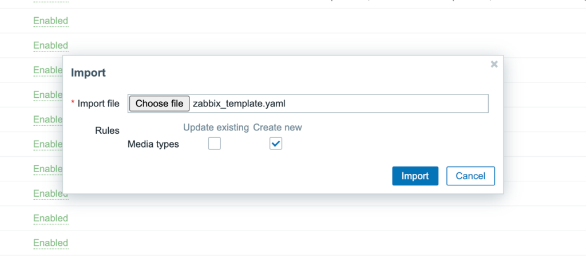

#### 5. Choose the saved .yaml file from your device and click on Import


#### 6. Verify that you can find new Media Type – Harpia

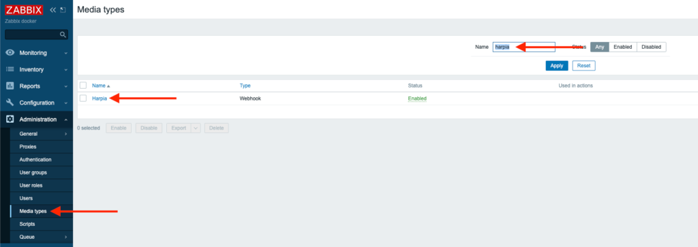

#### 7. Inside that Media Type, you need to specify Webhook URL from [Harp Integrations UI](../integration#how-to-find-url-for-integration)

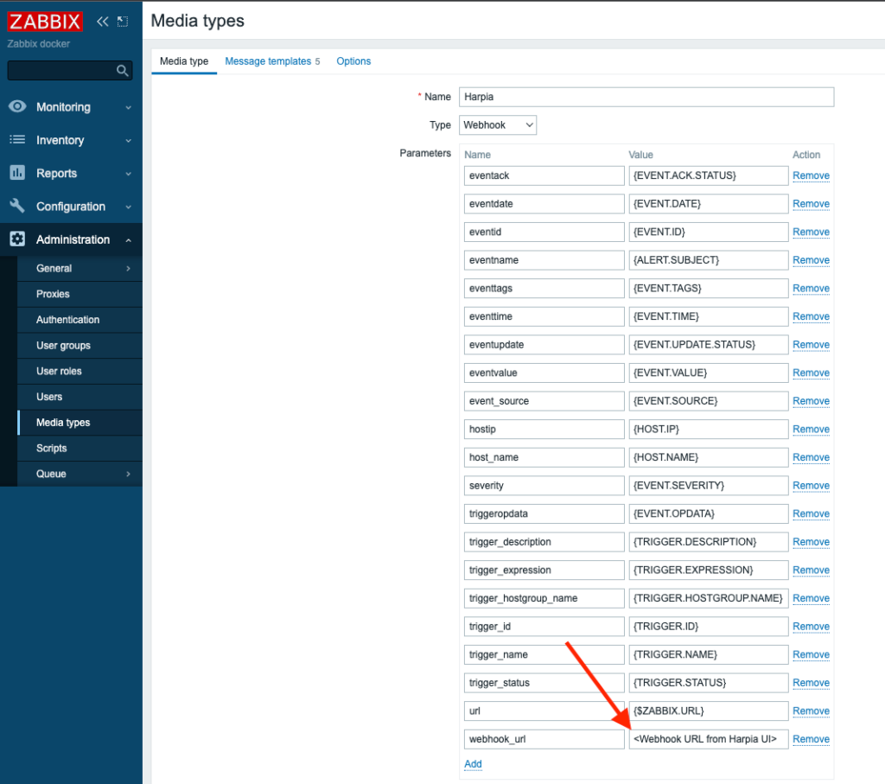

#### 8. Now, you can add this Media Type to any User/s with permissions to permissions to the servers. Click on the Users tab under the Administration section from the sidebar

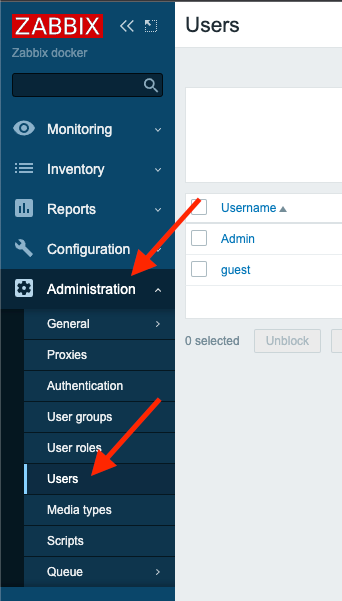

#### 9. Select User/s you want to add Squadcast Media Type to

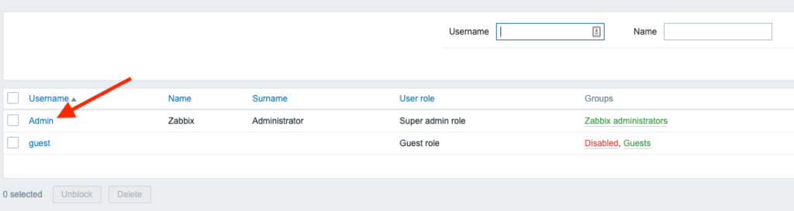

#### 10. Navigate to Media tab, click on Add to enter the following details:

- **Type:** Choose – Harpia
- **Send to:** Any Random text. We are not using it
- **When active:** Specify suitable values
- **Use if severity:** Select appropriate checkboxes
- Click on **Add** to save the Media for the User

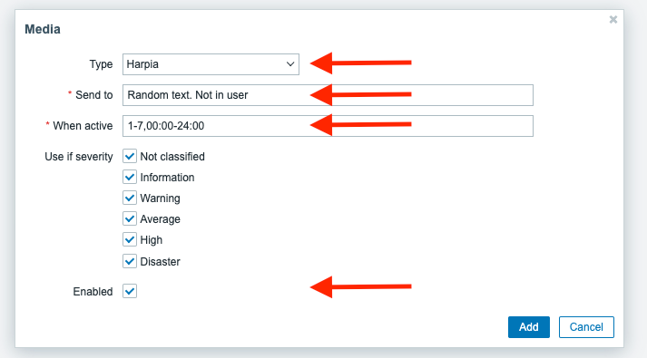

#### 11. Make sure you click on Update button on the Media page to save these details

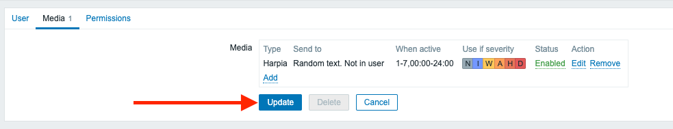

#### 12. Navigate to Actions tab under Configurations section

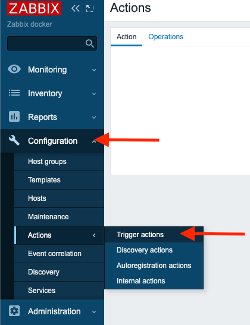

#### 13. Click on Create Action at the top right corner. In the Action tab, give the action a meaningful name, such as Harpia Notifications

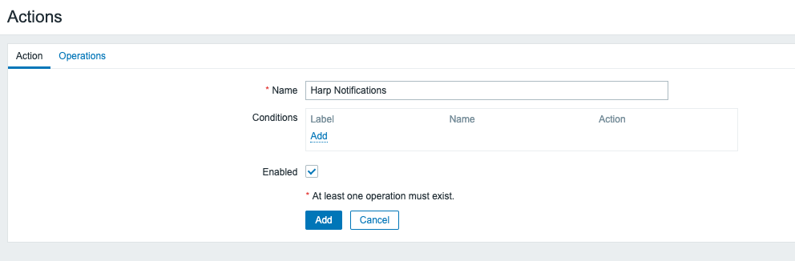

#### 14. On the same page, switch to Operations tab and configure available options as per your requirements

- **Send to users:** specify the user where you configured Media Type
- **Send only to:** Harpia

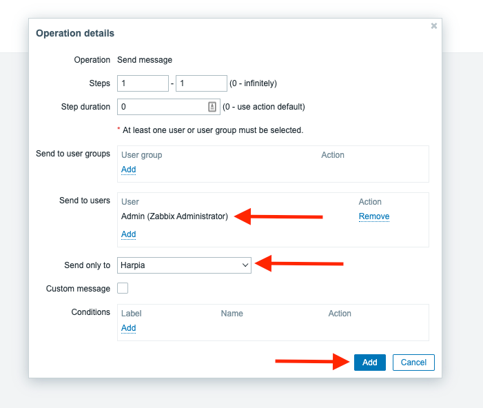

#### 15. Specify recovery operations – **Notify all involved**

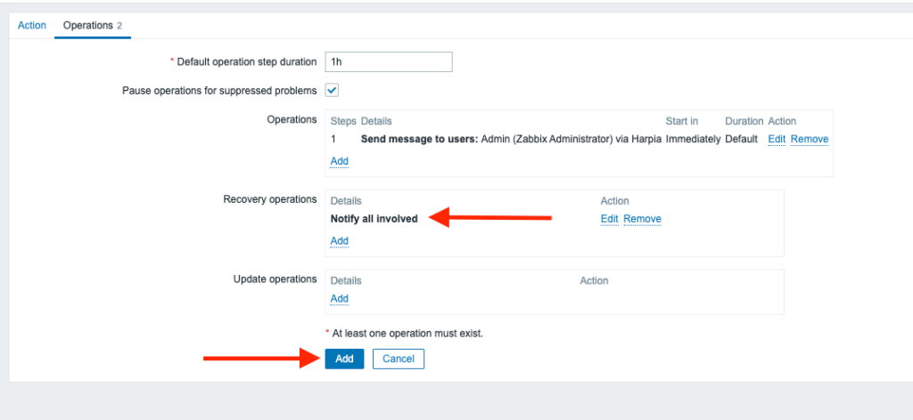

#### 16. New Trigger action is ready to use

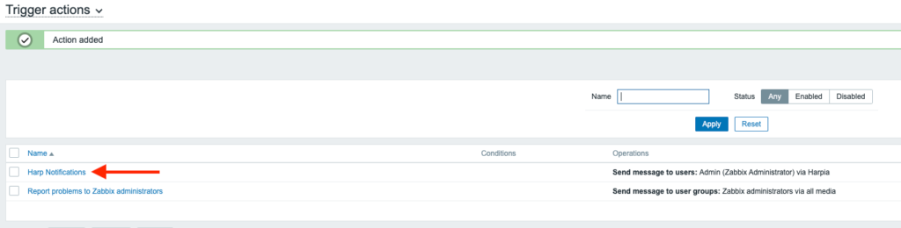

#### 17. You are good to go! Your Zabbix integration is completed, and you can start working with alerts in Harp

### Additional info
- [How to register new integration in Harp](../integration.md)
- [List of all integration](../category/incoming-integrations)
- [More details about Zabbix](https://www.zabbix.com/)


