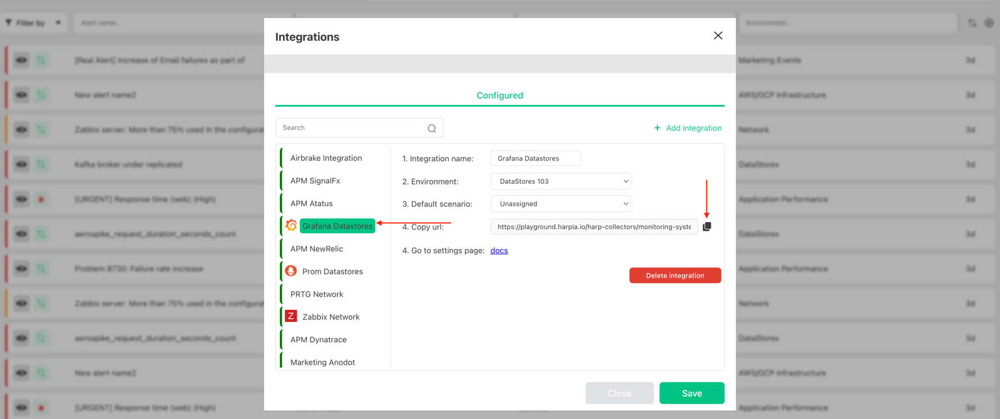

# Harp Integrations

Place to manage all your integrations with monitoring systems or any other systems that will send events to Harp Platform

The full list of Integration you can find [here](category/incoming-integrations)

### How to register new Integration

1. Go to `Menu` and choose `Integrations`

2. Add new integration

   

3. Specify the name of integration, choose monitoring system that you want to integrate and press **Add**

   

4. You should specify next info:
    - `Environment`: the folder on the left side panel where alert should appear. By default, you will have one - Default. [How to add new Environments](environments-overview.md)
    - `Scenario`: when and who should be notified once alert appears in Harp. By default, you will have one - Default (immidiatly show alert in UI). [How to add new Scenarios](scenarios-overview)
    - Once you click **Add** button it will generate the integration URL
    - Copy integration URL and add it to Grafana - [How to connect Monitoring System to Harp](category/incoming-integrations)

   

### How to find URL for integration

1. Go to `Menu` and choose `Integrations`

2. Choose your configured integration from the left panel and copy URL

3. If you didn`t create integrate yet - [How to create new integration](integration/#how-to-add-new-integration)