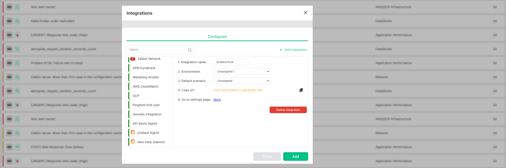

# Getting started

Our incident management system is designed to help teams quickly and effectively respond to and resolve any incidents that may occur, specifically in the tech industry.

Follow these steps to configure the first integration with your monitoring systems and learn more how to work with the Platform

### Connect Monitoring system to Harp
1. Go to Settings and choose Integrations

   

2. Add new integration

   

3. Specify the name of integration, choose Grafana integration and press **Add**

   

3. You should specify next info:
   - Environment: the folder on the left side panel where alert should appear. `By default, you will have one - Default`. [How to configure Environments](environments-overview.md)`
   - Scenario: when and who should be notified once alert appears in Harp. `By default, you will have one - Default (immidiatly show alert in UI)`. [How to configure Scenarios](scenarios-overview)
   - Once you click **Add** button it will generate the integration URL
   - Copy integration URL and add it to Grafana - [How to connect Monitoring System to Harp](category/incoming-integrations)

   

### Trigger Alert in Grafana
1. Select your default Environment - **Default**
2. Once alert will be triggered in Grafana - it should appear in UI

## What is next

1. [Main capabilities of Harp Platform](home-page-review.md)
2. [Manage alerts](alert-management.md)
3. [Integrate your monitoring systems with Harp](integration.md)
4. [Configure scenarios for your alerts](scenarios-overview/scenarios-overview.md)
5. [Configure Bots to work with your scenarios](configure-bots/intro.md)
6. [Invite your colleagues](user-management.md)
7. [Review analytics](reporting-overview.md)
8. [Check the health of your Platform](status-page-overview.md)