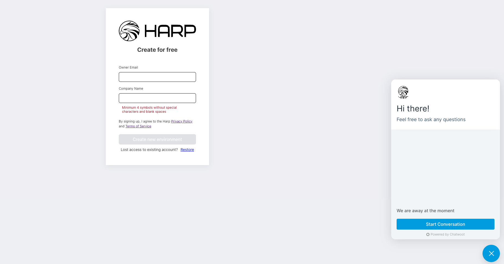

# Platform Installation

## In Cloud (SaaS)

You can easily request the new platform and receive it in few minutes

Go to the registration form - https://registration.harpia.io/

You should specify:
- `Owner Email`: you will receive access details once platform will be ready
- `Company Name`: unique name of the company


After submitting the form - you will receive the email with description how to access your platform

## On your server

You can install Harp Platform on Prem using the docker compose capabilities

It will spin up all services and databases and allow you to use the platform

### How to install
Install docker:
```
https://docs.docker.com/engine/install/ubuntu/
```

**Note:** Once you install Docker: `docker -v` command should return version of your docker

Install docker compose:
```
https://www.digitalocean.com/community/tutorials/how-to-install-and-use-docker-compose-on-ubuntu-22-04
```

**Note:** Once you install Docker Compose: `docker compose version` command should return version of your docker compose

Clone repo with docker-compose.yml:
```shell
git clone https://github.com/harpia-io/harpia.git
```

Go to harpia directory:
```shell
cd harpia
```

Run docker compose to install the platform (you should specify the IP address of your server):

**Note:** You need to replace `<SERVER_IP_ADDRESS>` with server IP where platform will be installed

```shell
HOST_IP=<SERVER_IP_ADDRESS> docker compose up -d && sleep 60 && docker restart harpia-harp-filters-1 && docker restart harpia-nginx-1
```

Visit your Portal - http://<SERVER_IP_ADDRESS>:
```shell
Login: admin
Password: admin
```

:::caution 

docker compose allows to install infrastructure on the single server and as a result you won`t have the redundancy for the platform

:::

## In Kubernetes

Feel free to contact us directly if you need the assist to install Harp Platform in your Kubernetes

How to contact:
- **Email:** nikolay.k@harpia.io
- **Linkedin:** https://www.linkedin.com/in/the-harpia-io
- **GitHub Issue:** https://github.com/harpia-io/harpia/issues

## Have a questions?

Feel free to contact us via chat

