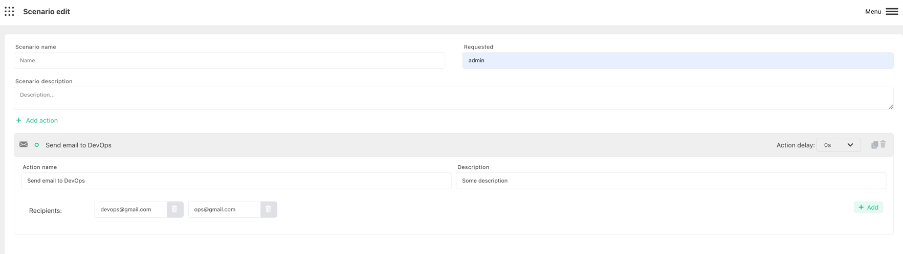

# Send Email

:::caution Prerequisite

Make sure that you configured [Email Harp Bot](../configure-bots/email.md). It won`t work without it.

:::

Harp Platform can send auto email notification to 1 or multiple recipients

You can also define how much time need to wait before trigger the action. 0s - means to send immediately

