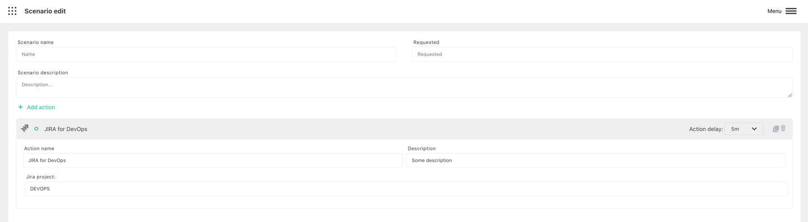

# Create Jira

:::caution Prerequisite

Make sure that you configured [JIRA Harp Bot](../configure-bots/jira.md). It won`t work without it.

:::

Harp Platform can automatically create JIRA ticket with alert info

You can also define how much time need to wait before trigger the action. 0s - means to send immediately

