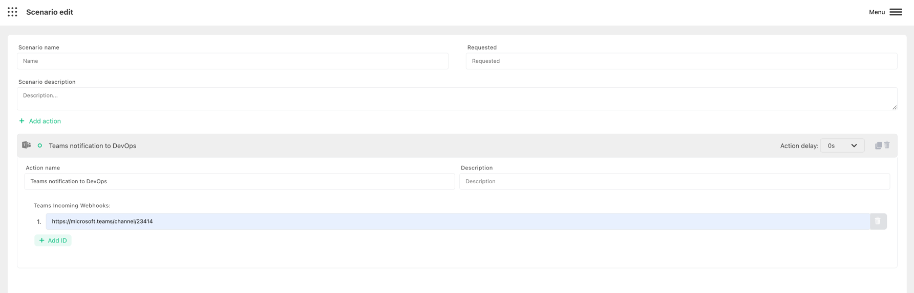

# Open chat in MSTeams

Harp Platform can automatically send notification to MS Teams via Webhook integration

You can also define how much time need to wait before trigger the action. 0s - means to send immediately

### How to configure MS Teams to send notifications

Use [official website](https://learn.microsoft.com/en-us/microsoftteams/platform/webhooks-and-connectors/how-to/add-incoming-webhook) to configure MS Incoming Webhook