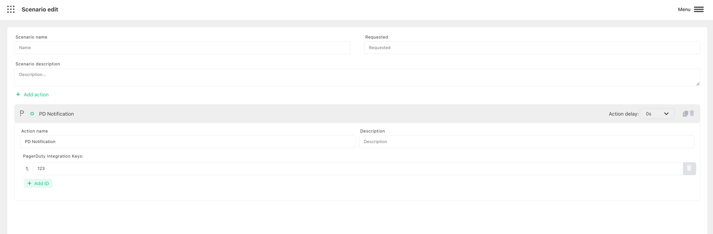

# Create PagerDuty event

Harp Platform can automatically send notification to PagerDuty

You can also define how much time need to wait before trigger the action. 0s - means to send immediately

### How to configure PD Integration Key to send notification

Use [PagerDuty official website](https://support.pagerduty.com/docs/services-and-integrations#generate-a-new-integration-key) to configure PD Integration Key