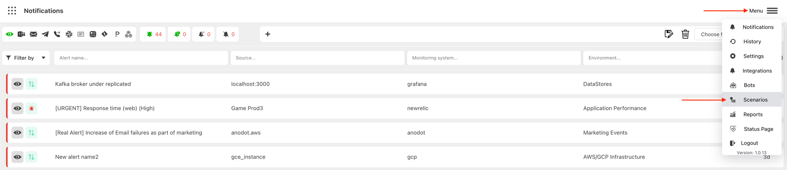
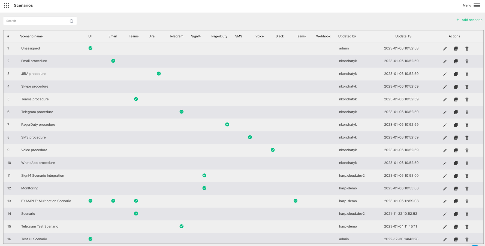
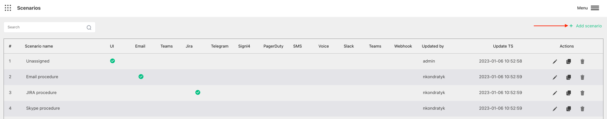
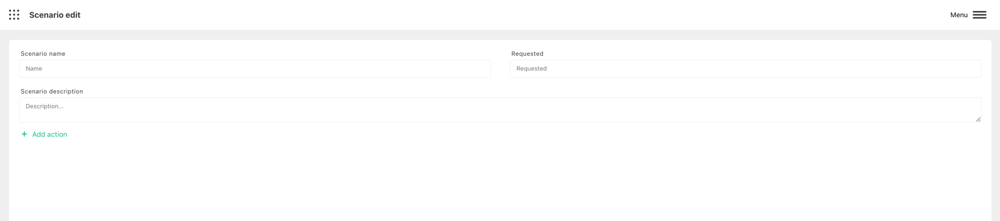
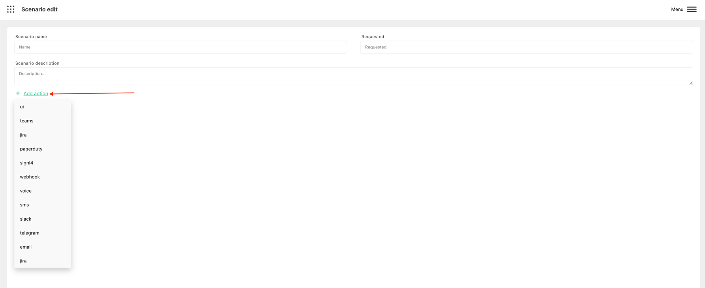
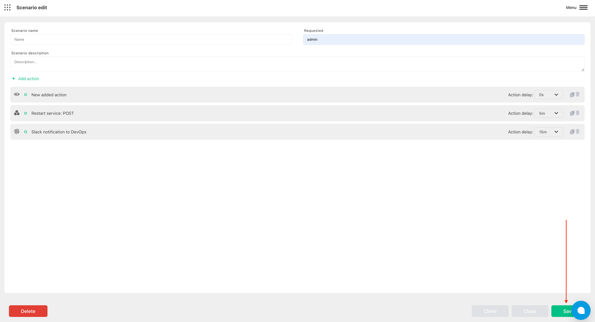

# Getting Started

Harp scenarios will describe the behaviour of your alert once it appears in Harp.

You can specify the channel where notification should appear, who should receive, the order of notifications and delay between them.

### How to add new scenario
1. Go to `Menu` and choose `Scenarios`

2. You will see all your scenarios with options to add new, modify or delete existing

3. Click on `Add scenario`

3. Specify the name, description of your scenario and the name of the person who requested it

4. Choose the action for your scenario. You can define multiple actions

5. Once you save your scenario it will be available in the [Integration](../integration) menu

### List of available actions
- [Send email](email.md)
- [Create Jira](jira.md)
- [Open chat in Microsoft Teams](microsoft-teams.md)
- [Create PagerDuty event](pagerduty.md)
- [Make a Phone Call](phone-call.md)
- [Create signl4 event](signl4.md)
- [Create Slack notification](slack.md)
- [Send SMS](sms.md)
- [Send Telegram message](telegram.md)
- [Trigger Webhook endpoint](webhook.md)