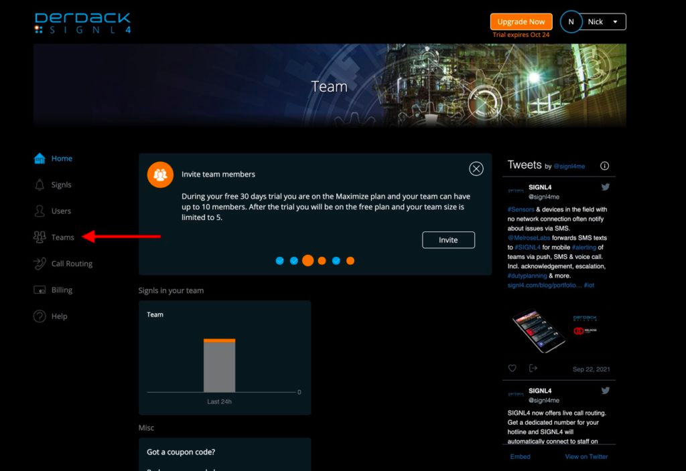
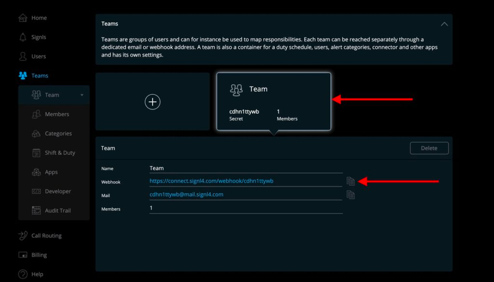

# Create Signl4 event

Harp Platform can automatically send notification to Signl4

You can also define how much time need to wait before trigger the action. 0s - means to send immediately

### How to find Webhook URL in SIGNL4

1. Create a new account or login into the existing one – https://account.signl4.com:

2. Choose the team that should receive and manage alerts from Harp and copies Webhook:

3. You are good to go! Your SIGNL4 integration is complete, and you can start working with alerts in Harp.