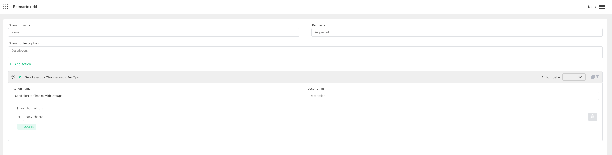

# Create Slack notification

:::caution Prerequisite

Make sure that you configured [Slack Harp Bot](../configure-bots/slack.md). It won`t work without it.

:::

Harp Platform can automatically send the notification to Slack channel

You can also define how much time need to wait before trigger the action. 0s - means to send immediately

Pay attention that Channel ID should be started with `#`

