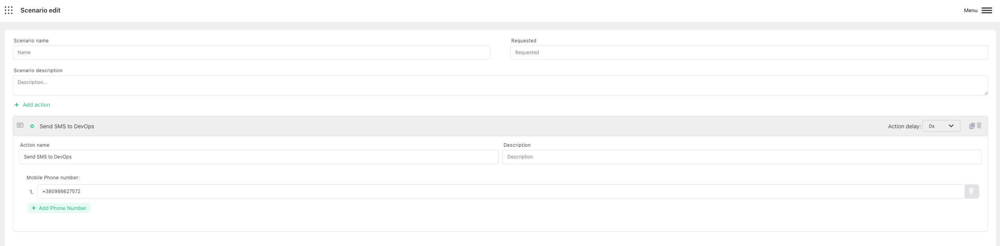

# Send SMS

:::caution Prerequisite

Make sure that you configured [SMS Harp Bot](../configure-bots/sms.md). It won`t work without it.

:::

Harp Platform can automatically send the SMS using integration with Twilio

You can also define how much time need to wait before trigger the action. 0s - means to send immediately

