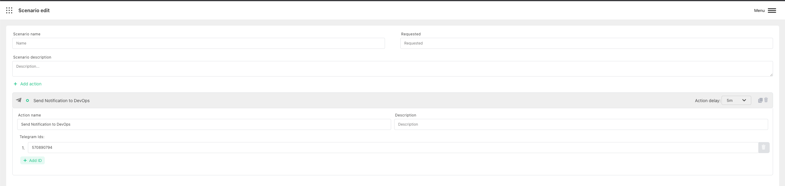

# Send Telegram message

:::caution Prerequisite

Make sure that you configured [Telegram Harp Bot](../configure-bots/telegram.md). It won`t work without it.

:::

Harp Platform can automatically send notification to specified Telegram Chat

You can also define how much time need to wait before trigger the action. 0s - means to send immediately

### 2. How to find your chat ID

There are few options to discover Chat ID - https://www.alphr.com/find-chat-id-telegram/