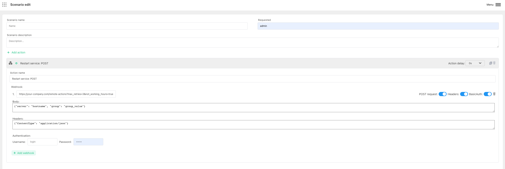

# Trigger Webhook endpoint

Harp Platform can automatically trigger your external Webhook and pass additional parameters.

It can be used for different scenarios. For example:
- Run some automation job on your side when alert was triggered
- Restart some service to fix the problem
- Scale service in k8s

You can also define how much time need to wait before trigger the action. 0s - means to trigger immediately

