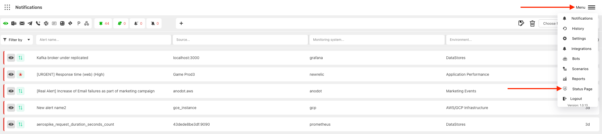
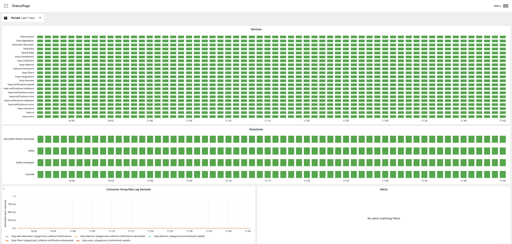
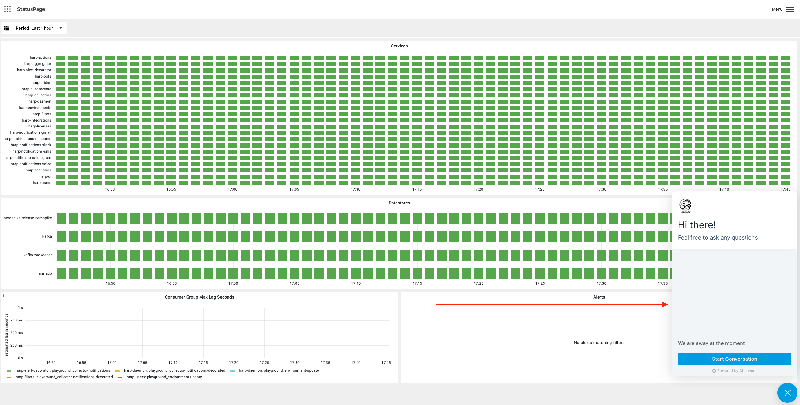

# Platform Health

Status page will help you to understand the health of your Harp Platform (SaaS or On Prem)

### How to find
Go to `Menu` and choose `Status Page`

### What you can see inside
- `Harp backend services`: if some services are red - part of the Harp functionality can be broken
- `Harp databases`: if some databases are red - part of the Harp functionality can be broken
- `Alerts in Queue`: if queue is increasing it means that you can receive alerts in Harp UI with daley

### What I should do in case of problem?

You can open the chat icon and notify us about potential problems

