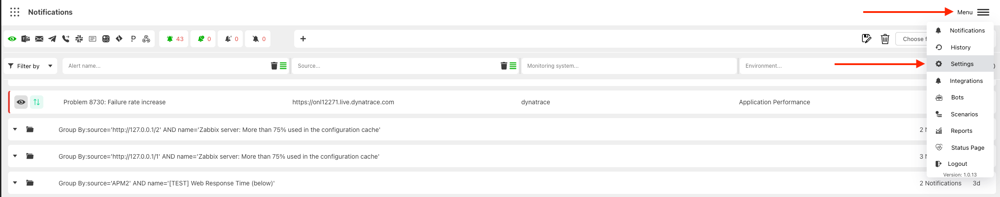
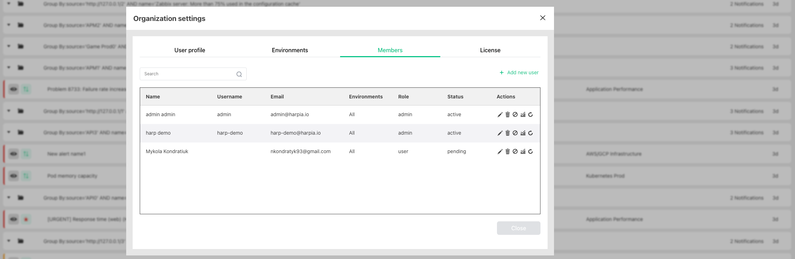
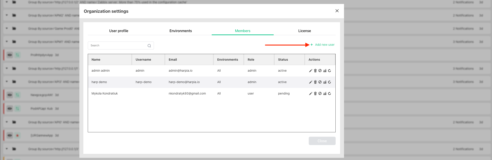
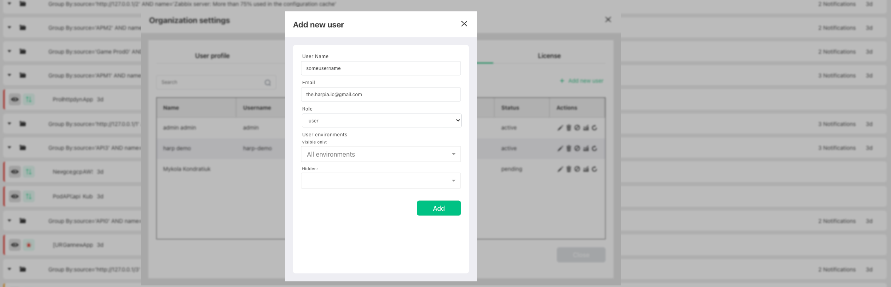
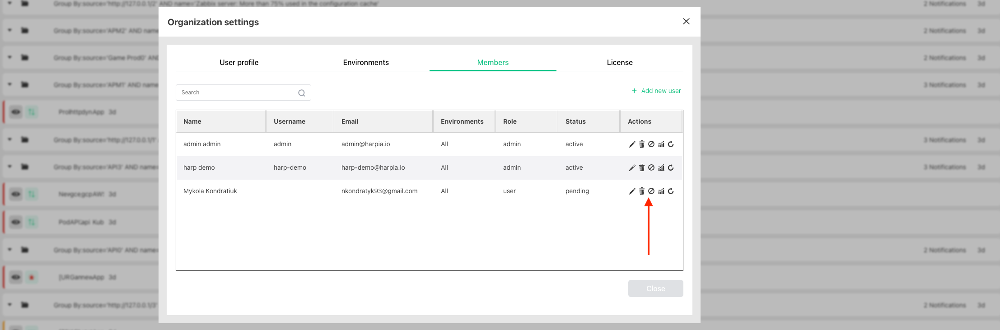

# User Management

Place to manage all accounts inside Harp

### How to find

1. Go to `settings`

2. Choose `Members`

### Invite new user

Press the button to `Add new user`

In new form need to specify the next info:
- `User Name`: it should be unique since user will use it to log in to the system. Can be changed by user from invite email.
- `Email`: email address which will be used to send the invite
- `Role`: choose the relevant role
- `User Environments`: specify the list of environments that will be visible or hidden for this user

Once you add new user - email notification will be sent to the specified email address and user will be able to finish the registration by specifying the password

### User roles

There are 3 possible roles:
- `Owner`: has full permissions and can invite new users with `admin` role
- `Admin`: has full permissions and can invite new users only with `user` role
- `User`: has full permissions except modifying the settings

### User status

There are 3 possible statuses:
- `Active`: user can log in to the system
- `Pending`: user receive invite but didn`t confirm it yet
- `Disable`: user cannot log in to the system since account was disabled 

### Actions with user account

- `Edit user profile`: change profile details
- `Block user`: disable possibility to login for the user
- `Delete user`: delete user from the system
- `Reset password`: send an email with password reset form

